# 01C 语言环境安装及编辑器配置

[学习地址](https://www.bilibili.com/video/BV1Wt41127xf?p=7&spm_id_from=pageDriver)

## 一、编译软件及编辑器软件mingw 安装 

[软件地址](https://pan.baidu.com/s/12cFDhHOCf9FSFW0rLOUXBA)   提取码：1022 

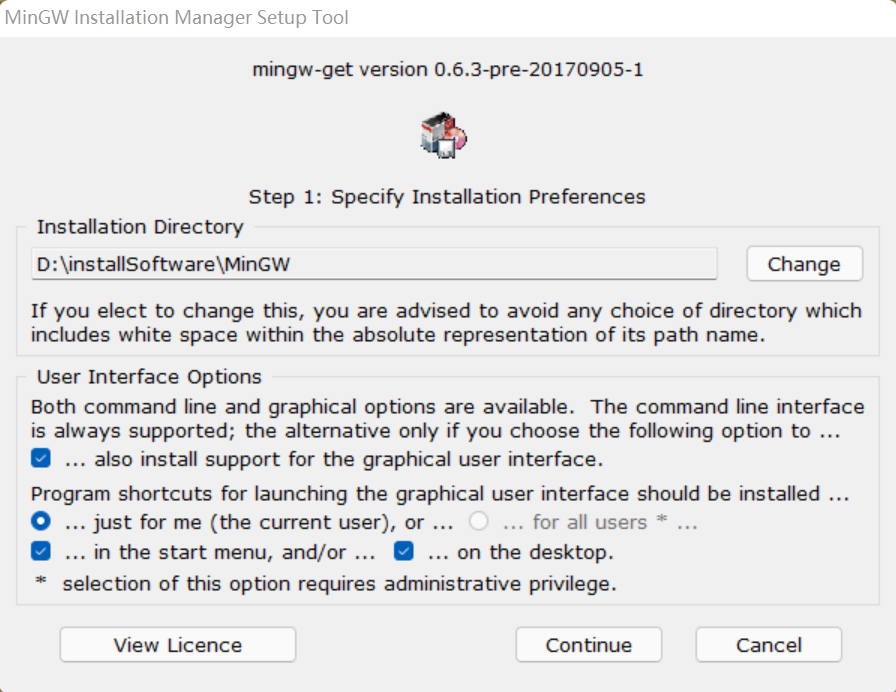

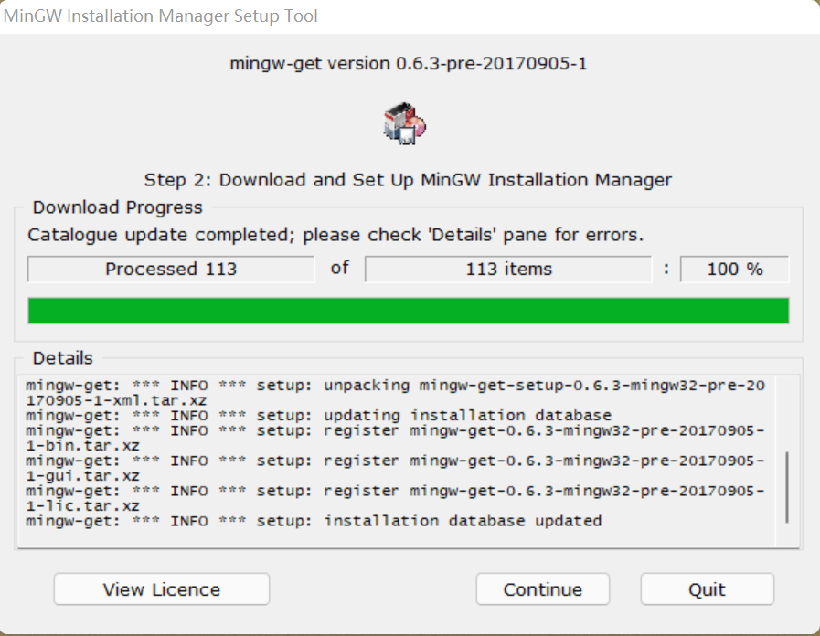

continue

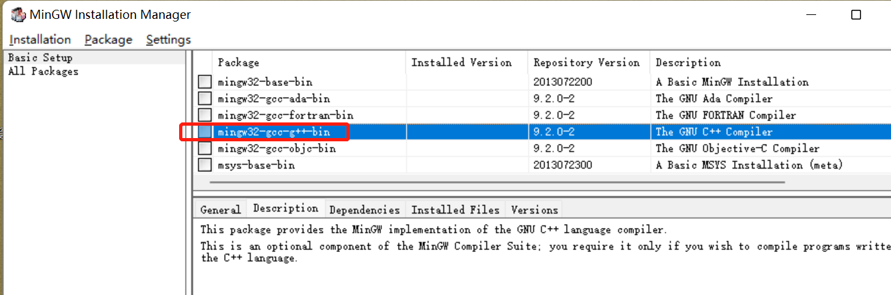

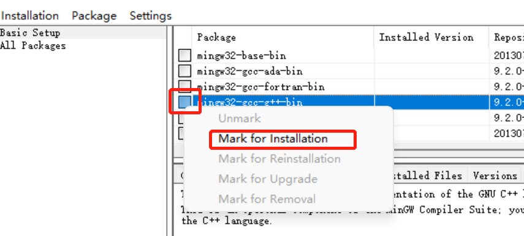

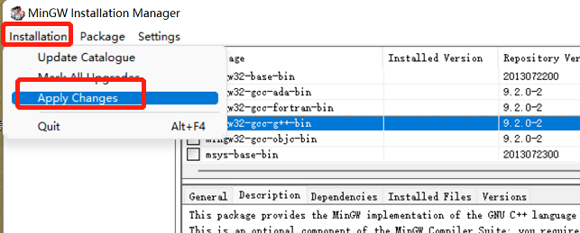

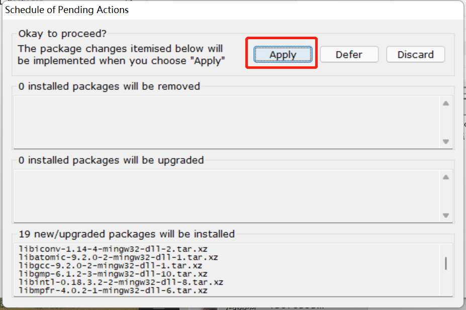

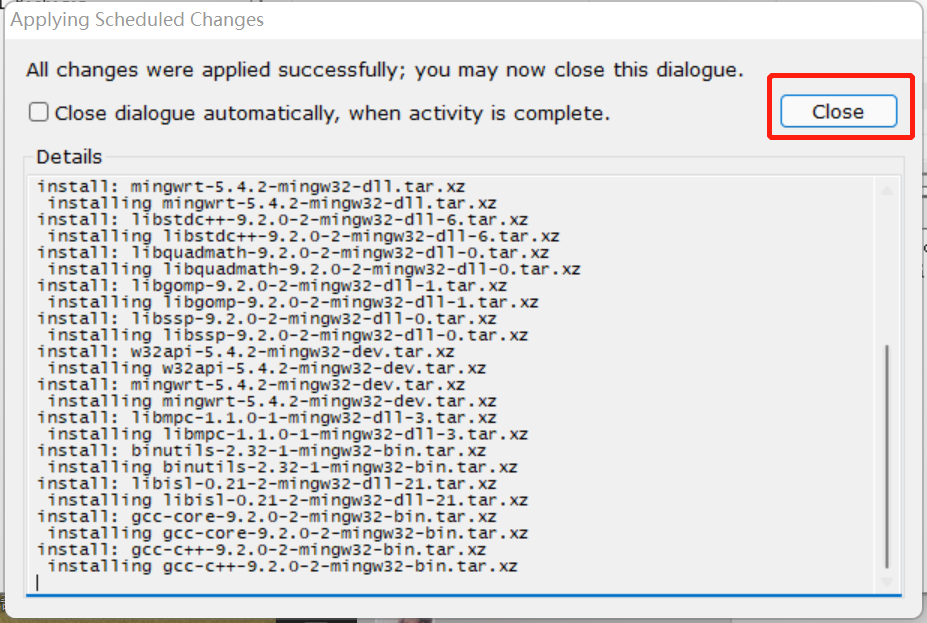

添加环境变量

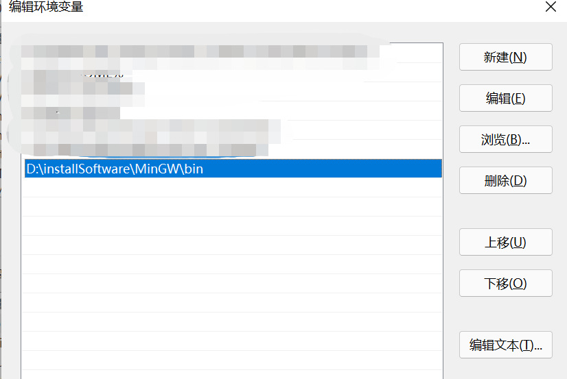

验证安装是否成功

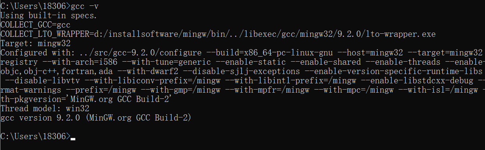


## 二、sublime配置c语言编译

sublime 软件：

[软件地址](https://pan.baidu.com/s/1qa9Ux0NA67_Qhaz88kfG_Q)     提取码：1022 

参考链接：[配置sublime编译运行C语言方法](https://hwdong.net/2017/10/30/sublime%E9%85%8D%E7%BD%AEMinGW%E6%90%AD%E5%BB%BAC%E7%BC%96%E7%A8%8B%E7%8E%AF%E5%A2%83/)

1. 按照菜单Tools——>Build System ——>New Build System新建一个“Build System”，其中输出下面内容：

   ```
   {
     "working_dir": "$file_path",
     "cmd": "gcc -Wall -fexec-charset=GBK \"$file_name\" -o \"$file_base_name\"",
     "file_regex": "^(..[^:]*):([0-9]+):?([0-9]+)?:? (.*)$",
     "selector": "source.c",
    
     "variants": 
     [
       { 
       "name": "Run",
             "shell_cmd": "gcc -Wall -fexec-charset=GBK \"$file\" -o \"$file_base_name\" && start cmd /c \"\"${file_path}/${file_base_name}\" & pause\""
       }
     ]
   }
   ```

   将该“Build System”保存为比如“C.sublime-build”到“…/Packages/User/”路径下：Packages/User/C.sublime-build

   运行时，选择这个配置

   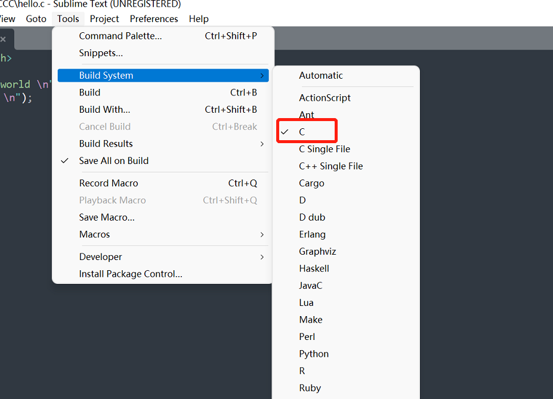

   快捷键 ctrl+shift+B 先编译再运行

   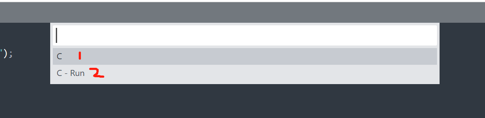

查看效果

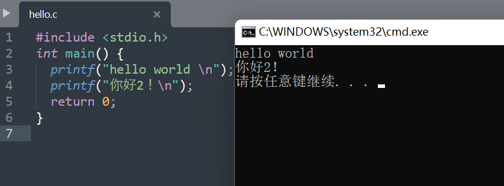

## 三、Code::Blocks安装

软件地址：[codeblocks](https://pan.baidu.com/s/18XPklJ4mTCegIS8oj4LSRQ)
提取码：1022 

傻瓜式安装 下一步下一步那种（你懂的）

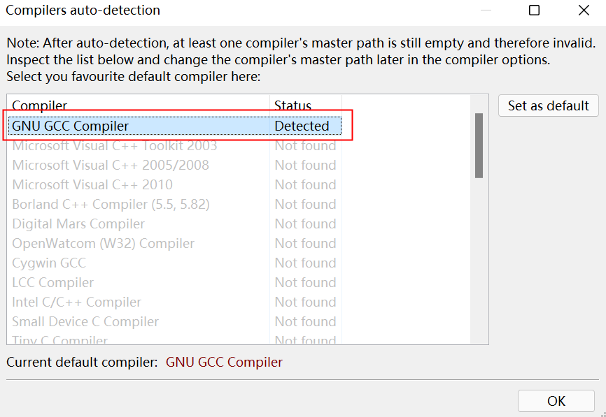

新建项目：

File->New->Project->console application->go

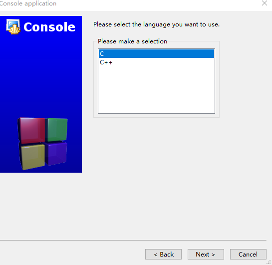

next->输入项目名称及路径

build and run 项目

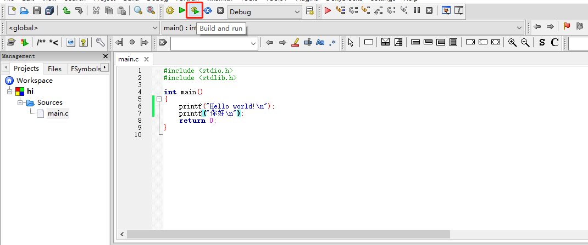

结果如下

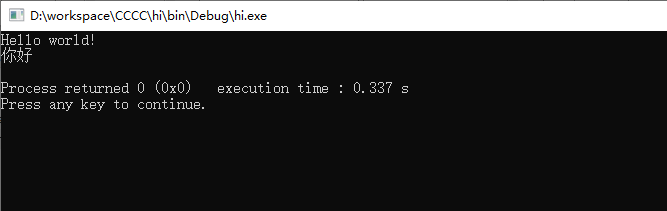


