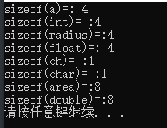

# 02C 程序的相关语法

## 一、方法

```c
#include <stdio.h>
int one(){
	printf("我是一个方法！\n");
	return 0;
}
int main() {
	printf("牛b \n");
	one();
	return 1;
}
```

## 二、条件编译指令 #if 、#else、#elif、#endif

```c
// #if
#include <stdio.h>

#if 1 // 1代表为true，执行
int main() {
	printf("我是1里面的内     容 \n");
}
#endif

#if 0 // 0代表为false，不执行 可以自己测试 1 0互换
int one(){
	printf("我是一个方法！\n");
	return 0;
}

int main() {
	printf("牛b \n");
	one();
	return 1;
}
#endif
```

```c
// #if、#else、#endif
#include <stdio.h>

#if 0 // 1代表为true，执行, 0代表为fasle，不执行，可换这里的值看一下输出有什么不同
int main() {
	printf("我是1里面的内     容 \n");
}
#else
int main() {
	printf("我是else里面的内     容 \n");
}
#endif
```

## 三、转义字符

```c
/*
\n 换行符
\t 制表符
\v 垂直制表符
\' 单引号字符'
\\ 反斜杠
\? 问号字符
\a 响铃
*/
//以下为测试代码
#include <stdio.h>

#if 1 // 0代表为false，不执行 可以自己测试 1 0互换
int zyzf() {
	printf("helloworld!\n");
	printf("hello\nworld!\n");
	printf("hello\tworld!\n");
	printf("hello\vworld!\n");
	printf("hello\'world!\n");
	printf("hello\"world!\n");
	printf("hello\\world!\n");
	printf("hello\\hworld!\n");
	printf("hello\aworld!\n");
	return 0;
}


int main() {
	zyzf();
	return 1;
}
#endif
```

是不是听到了 windows 错误铃声呢？试着把\a 这行注释掉，看看会发生什么吧！

## 四、变量、格式化输出

```c
#include <stdio.h>
// %f 格式符，用来输出float类型的值
// radius 和 area 是变量 存值的
int main() {
	float radius = 2.5;
	float area = 3.14*radius*radius;
	printf("area = %f\n", area);
	printf("半径是%f的圆，面积area = %f\n", radius, area);
	printf("半径是%3.1f的圆，面积area = %7.3f\n", radius, area); // %3.1  总长度为3，小数点后为1；%7.3 总长度为7，小数点后为3
}
```

变量类型：int(整型)、char(字符型)、float(单精度浮点实数型)、double(双精度浮点实数型)

```c
#include <stdio.h>

#if 1
// 声明变量,只能存所声明的类型
int main() {
	int a;
	float radius;
	char ch = 'a';
	double area;
}
#endif
```

格式化输出

%开头的叫做“格式符”，表示”格式串”后的输出项

按照什么数据类型进行输出，有几个输出项

格式串中就有几个格式符。常见的格式符有 ∶

%c ,表示对应输出项是字符 char

%d,表示对应输出项是整数类型 int

%f,表示对应输出项是单精度实数类型 float

%lf ,表示对应输出项是双精度实数类型 double

%s ,表示对应输出项是一个字符串，即一串字符

```c

#include <stdio.h>


#if 1
// 声明变量,只能存所声明的类型
int main() {
	int a;
	float radius;
	char ch = 'a';
	double area;

	printf("a=%d, radius=%f, ch=%c\n",a, radius, ch);
	printf("area= %lf\n", area);
	printf("%s\n", "Hello Wold");
}
#endif
```

## 五、宏定义

```c
#include <stdio.h>
#define PI 3.1415 // 宏定义
#if 1
int main() {
	float radius = 2.5;
	printf("area = %f\n", PI*radius*radius);
}
#endif
```

## 六 、sizeof():类型变量占据的内存大小

```c

#include <stdio.h>

#if 1
int main() {
	int a; // 4
	float radius; // 4
	char ch = 'a'; // 1
	double area; // 8
	printf( "sizeof(a)=: %d\n",sizeof(a));
	printf( "sizeof(int)= :%d \n",sizeof(int));
	printf( "sizeof(radius)=:%d\n",sizeof(radius));
	printf( "sizeof(float)=: %d\n",sizeof(float));
	printf( "sizeof(ch)= :%d \n",sizeof(ch));
	printf( "sizeof(char)= :%d\n",sizeof(char));
	printf( "sizeof(area)=:%d\n",sizeof(area));
	printf( "sizeof(double)=:%d\n" ,sizeof(double));

}
#endif
```

结果



## 七、输入数据 scanf()方法

```c

#include <stdio.h>

#if 1
int main() {
	float radius;
	int a,b;
	scanf("%f", &radius); // &代表取地址，将地址传给变量
	printf("%f\n", radius);
	scanf("%d,%d", &a, &b);
	printf("%d,%d\n", a, b);
	return 0;
}
#endif
```
