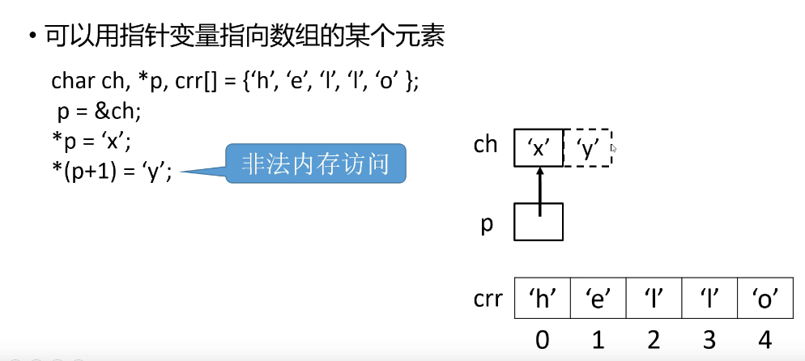
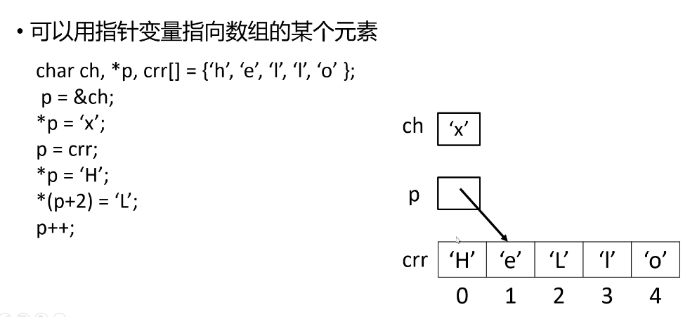
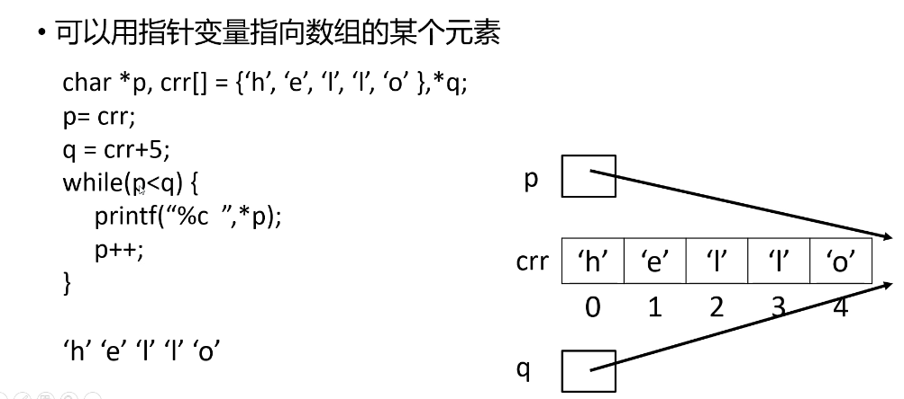
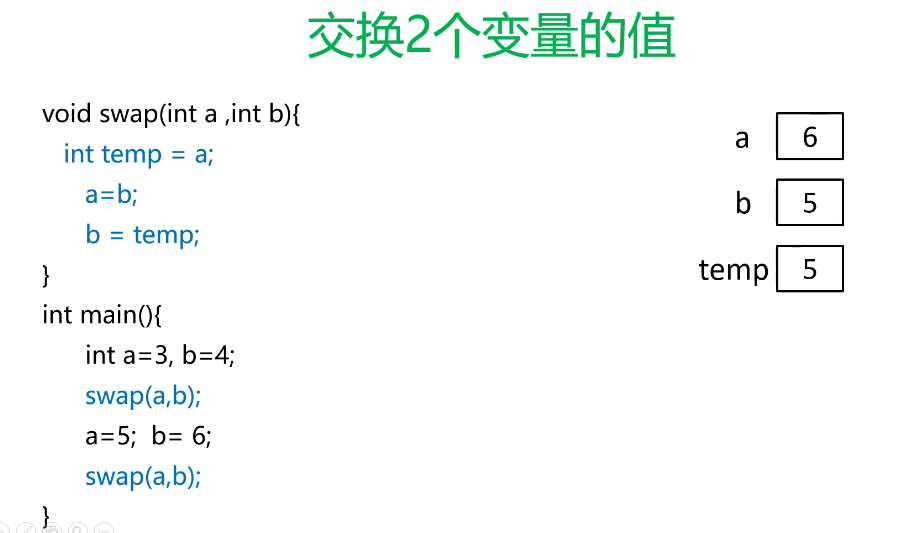
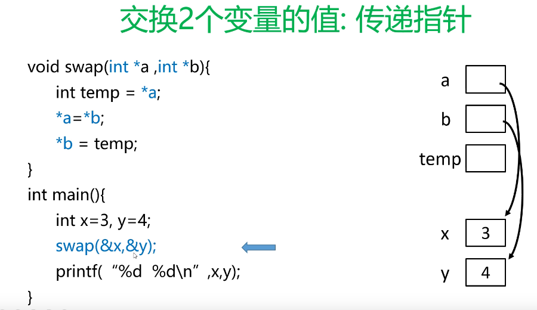

# 04C 程序语法之语句

## 1.条件语句

```c
/*
条件语句  if
*/
#include <stdio.h>

int main() {
	float score;
	scanf("%f", &score);
	if(score >= 90) {
		printf("你的分数为%4.1f\n", score);
		printf("你的成绩是优秀！\n");
	} else if (score >= 80) {
		printf("你的分数为%4.1f\n", score);
		printf("你的成绩是良好！\n");
	} else if(score >= 70) {
		printf("你的分数为%4.1f\n", score);
		printf("你的成绩是中等！\n");
	} else if(score >= 60) {
		printf("你的分数为%4.1f\n", score);
		printf("你的成绩是及格！\n");
	} else {
		printf("你的分数为%4.1f,未通过考试！\n", score);
	}
}

```

```c

/**
 * switch
 * 
 * */
#include <stdio.h>

int main() {
	int score;
	scanf("%d", &score);
	switch(score){
		case 1:
			printf("你输入的是1\n");
			break;
		case 2:
			printf("你输入的是2\n");
			break;
		case 10:
			printf("你输入的是10\n");
			break;
		case 40:
			printf("你输入的是40\n");
			break;
		case 100:
			printf("你输入的是100\n");
			break;
		default:
			printf("你输入的值不是之前的值\n");
			break;
	}
}
```

```c
/**
 * 计算器小demo
 * 
 * */
#include <stdio.h>

int main() {
	float a,b;
	char op;
	scanf("%f %c %f", &a, &op, &b);
	switch(op){
		case '+':
			printf("%f %c %f = %f", a, op, b, a+b);
			break;
		case '-':
			printf("%f %c %f = %f", a, op, b, a-b);
			break;
		case '*':
			printf("%f %c %f = %f", a, op, b, a*b);
			break;
		case '/':
			printf("%f %c %f = %f", a, op, b, a/b);
			break;
		default:
			printf("你输入的运算符有误\n");
			break;
	}
}
```

## 2.循环语句

```c
#if 0
/*
  循环语句 while
*/
#include <stdio.h>

int main() {
	int sum = 0, i=1;
	while(i<=100){
		sum += i;
		i++;
	}
	printf("%d\n", sum);
}

#endif

#if 1
/*
  循环语句 do-while 
*/
#include <stdio.h>

int main() {

	int sum = 0, i=1;
	do {
		sum += i;
		i++;
	}while(i<=100);
	printf("%d\n", sum);
}

#endif
```

```c
#if 0
/*
  循环语句 for
*/
#include <stdio.h>

int main() {
	int sum = 0;
	for(int i = 1; i <= 100; i++) {
		sum += i;
	}
	printf("%d\n", sum);
}

#endif

#if 1
/*小练习  判断一个数是质数*/
#include <stdio.h>
int main() {
	int a,flag = 0; // flag是1的时候表示是质数,0表示不是质数
	scanf("%d", &a);
	for(int i=2;i<a;i++){
		if(a%i==0){
			flag = 1;
			break;
		}
	}
	if(flag==1){
		printf("%d不是质数。\n",a);
	} else {
		printf("%d是质数。\n",a);
	}
}

#endif
```

## 3.数组

```c
#include <stdio.h>
int main() {
	int arr[5]; // 5个长度的数组
	arr[0] = 23;
	arr[2] = 7;

	for(int i=0; i<5;i++) {
		arr[i]=2*i+1;
	}

	for(int i=0; i<5;i++) {
		printf("%d\t", arr[i]);
	}
	printf("\n");


	int brr[5] = {3,6,7,8}; // 声明方式2-固定数组长度

	for(int i=0; i<5;i++) {
		printf("%d\t", brr[i]);
	}
	printf("\n");

	int crr[] = {30,60,76,83}; // 声明方式2-根据定义的数据来确定长度

	for(int i=0; i<4;i++) { // 数组越界 会提示非法入侵访问
		printf("%d\t", crr[i]);
	}
	printf("\n");
}
```

```c

#include <stdio.h>
/* 手动输入成绩，求平均分*/
int main() {
	float scores[1000],score,sum=0;
	int n=0;
	while(1){
		scanf("%f", &score);
		if(score < 0) {
			break;
		} else {
			scores[n]=score;
			n++;
			sum += score;
		}
	}

	for(int i=0;i<n;i++){
		printf("%f\t", scores[i]);
	}
	printf("平均分:%5.2f\n", sum/n);
}
```

## 4.函数和函数传参

```c

#include <stdio.h>
// 一个参数
// 函数定义  void 无返回类型
void f(int n) { // n 形参
	for (int i = 0; i < n; ++i){
		printf("你好！ %d\n", i);
	}
}

int main() {
	f(3); // 函数调用  3 实参
	return 0;
}


// 函数多个参数传递


#include <stdio.h>

// 求和 int 返回整型
int add(int a, int b) { // n 形参
	return a + b;
}

int main() {
	int c = add(3, 5); // 函数调用  3 实参
	printf("c=%d\n",c);
	return 0;
}
```

## 5.递归函数！！！

```c

// 递归函数  求n的阶乘
#include <stdio.h>

int fact(int n) {
	int reg = 1;
	for(int i=1;i<=n;i++) {
		reg *= i;
	}
	return reg;
}

int main() {
	int c = fact(6);
	printf("阶乘是=%d\n",c);
	return 0;
}


// 递归函数  求n的阶乘
#include <stdio.h>

int fact(int n) {
	if (n == 1) {
		return 1;
	}
	return n * fact(n - 1);
}

int main() {
	int c = fact(4);
	printf("阶乘是=%d\n",c);
	return 0;
}


// 斐波那契数列 f(0)=1 f(1)=1  n>=2时 f(n)=f(n-1)+f(n-2)
#include <stdio.h>

int fib(int n) {
	if (n < 2) {
		return 1;
	}
	return fib(n-1) + fib(n-2);
}

int main() {
	int c = fib(4);
	printf("斐波那契数列是=%d\n",c);
	return 0;
}
```

## 6.指针(pointer)---重点理解 地址和值

指针：是一个**地址**，变量的地址，可以用取地址符号&得到变量的地址

指针变量：是一个**变量**，存储的是“指针（地址）”

举例：设type是一个数据类型，则type*也是一个类型，叫做type的指针类型。

type*类型的变量存储的type类型变量的地址，即：int a = 3； int *p = &a;

可以通过“解引用运算符”---“*”得到一个指针变量指向的变量：

```c
// 举例：
int a=3,b=4;
int *p = &a; //*是指针  存储的是a的地址
*p = 6; // *是解引用运算符 将p解引用 得到a的值，把6赋值给a
b = *p; // *p 是6


#include <stdio.h>
int main() {
	int a = 3, b=4;
	int *p = &a; // 指针类型声明的p 存储了a的地址

	printf("%p, %p\n", &a, p); // a的地址 和 p(存储的a的地址)是一样的

	*p = 7; // *是解引用运算符 获取到a的值 降7赋值给a
	printf("a=%d, *p是%d\n", a, *p); // *是解引用

	b=*p + 1;
	printf("a=%d, *p是%d,b是%d\n", a, *p, b); // *是解引用
}
```


```c

#include <stdio.h>
int main() {
	int arr[] = {2,3,4,5,6}, b=2; // 数组声明 arr[]
	int *p = arr; // 指针类型声明的p 存储了arr[0]的地址 等价于 int *p = &(arr[0])
//  int *p = &(arr[0]) 和上面一样
	printf("%p\t%p\t%p\n",arr, &(arr[0]), p); // arr的地址,arr首项的地址,p的地址

	printf("%d\t%d\n", *p, arr[0]); // *是解引用运算符
	printf("%d\t%d\n", *(p+2), arr[2]); // *是解引用运算符 p是地址 +2地址向右移动2位
	printf("%d\t%d\n", p[2], arr[2]); // 
	printf("%d\t%d\n", p[2], *(arr+2)); // arr是arr[0]的地址，右移两位

	//结论  arr[i] == *(arr+i)=p[i] == *(p+i)

	b=p[3];
	printf("%d\t%d\n", b,*(p+3));

	// 不一样的循环

	for(p=arr;p<arr+5;p++){ // p是地址，arr是第0个元素的地址；+5右移5个长度
		printf("%d\t", *p); // *p 解引用运算符
	}
}
```

指针存的是地址  *p 就可以获取到地址里面的值








是否真的交换了？






```c

#include <stdio.h>

void print(char *p, char *q) {
	while(p<q){
		printf("%c \n", *p);
		p++;
	}
}

int main() {
	char *p, crr[] = {'h', 'e', 'l', 'l', 'o'}, *q;
	q = crr + 5;
	p = crr;

	print(p, q);
    
    p = crr;
    *p = 'A';
    p++;

    while(p<q) {
    	*p = *(p-1)+1;
    	p++;
    }
    
    p = crr;
    print(p,q);

}
```

## 7.结束字符

结尾带有“结束字符“即‘\0’的字符数组

```c

/*
   C语言字符串出来函数：头文件 string.h
*/
#include <stdio.h>
#include <string.h>

int main() {
	char crr[] = {'h', 'e', 'l', 'l', 'o'};
	char str[] = {'h', 'e', 'l', 'l', 'o', '\0'};
	char* p = "hello";

	printf("%d %d\n", strlen(str), strlen(p)); // 字符的长度

	strcpy(str, "Wang");

	printf("%s\n", p);
	printf("%s\n", str);
	printf("%s\n", crr);
}
```


