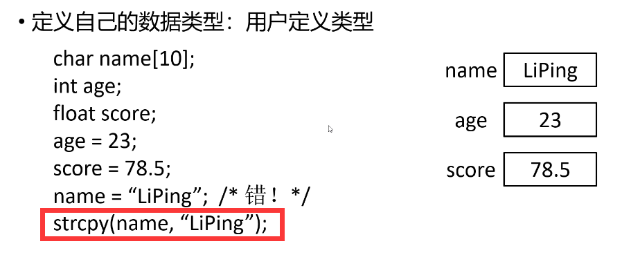
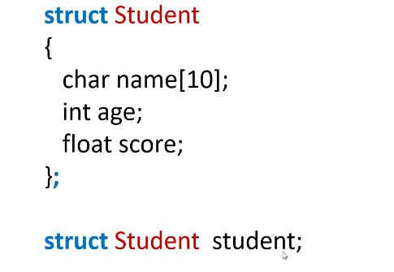
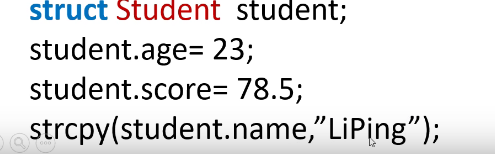

# 05C程序之结构struct

## 一.内在类型

1.基本类型：float，double，char，int，long，short，unsigned int，unsigned char

2.派生类型：数组、指针

数组：int arr[5]; char crr[6]

指针：int *p; char &q;

3.定义自己的数据类型：用户定义类型

旧方式



新方式：

struct Student // 定义了 Student 数据类型



访问student里面的属性



```c

struct Student
{
	char name[10];
	int age;
	float score;
};

#include <stdio.h>
#include <string.h>

int main() {

	struct Student stu; //创建一个学生实例 

	strcpy(stu.name, "LiPing");
	stu.age = 20;
	stu.score = 99.5;

	printf("姓名%s 年龄%d 成绩%lf", stu.name,stu.age,stu.score);


	return 0;
}

```

指针 *p = stu   p->内部属性

```c
// 加入指针  
// 还可以通过间接访问运算符 “->” 去访问 p指向的结构类型变量stu

struct Student
{
	char name[10];
	int age;
	float score;
};

#include <stdio.h>
#include <string.h>

int main() {

    // 定义了struct student的变量 stu
	struct Student stu; 

    // 定义struct Student*的变量p
	struct Student *p = 0;

	p = &stu;

	// *p 就是 stu

	strcpy((*p).name, "LiPing");
	(*p).age = 20;
	(*p).score = 99.5;

	printf("姓名%s 年龄%d 成绩%lf \n", (*p).name,(*p).age,(*p).score);

	// 还可以通过间接访问运算符 “->” 去访问 p指向的结构类型变量stu
	strcpy(p->name, "ZhaoMing");
	p->age = 30;
	p->score = 100;

	printf("姓名%s 年龄%d 成绩%3.1lf \n", p->name,p->age,p->score);


	return 0;
}
```

```c

struct Student
{
	char name[10];
	int age;
	double score;
};

#include <stdio.h>
#include <string.h>


void Scanf(struct Student stu) {
	printf("请输入 姓名、年龄、分数\n");
	scanf("%s", stu.name);
	scanf("%d", &(stu.age));
	scanf("%lf", &(stu.score));
	printf("姓名%s 年龄%d 成绩%lf\n", stu.name,stu.age,stu.score);

}

void Scanf2(struct Student *stu) {
	printf("请输入 姓名、年龄、分数\n");
	scanf("%s", stu->name);
	scanf("%d", &(stu->age));
	scanf("%lf", &(stu->score));
	// printf("姓名%s 年龄%d 成绩%lf\n", stu->name,stu->age,stu->score);

}

int main() {
	// 定义数组
    // 定义了struct student的变量 stu
	struct Student students[100]; 
	struct Student student; 

    // 记得比较 Scanf和Scanf2的差异
    // Scanf(student); //仅传入了值 并没有传入地址 需要传入地址

     Scanf2(&student); //将student的地址传进去
	 printf("姓名%s 年龄%d 成绩%lf\n", student.name,student.age,student.score);

	return 0;
}

```


```c

struct Student
{
	char name[10];
	int age;
	double score;
};

#include <stdio.h>
#include <string.h>


void Scanf(struct Student stu) {
	printf("请输入 姓名、年龄、分数\n");
	scanf("%s", stu.name);
	scanf("%d", &(stu.age));
	scanf("%lf", &(stu.score));
	printf("姓名%s 年龄%d 成绩%lf\n", stu.name,stu.age,stu.score);

}

void Scanf2(struct Student *stu) {
	printf("请输入 姓名、年龄、分数\n");
	scanf("%s", stu->name);
	scanf("%d", &(stu->age));
	scanf("%lf", &(stu->score));
	// printf("姓名%s 年龄%d 成绩%lf\n", stu->name,stu->age,stu->score);

}

int main() {
	// 定义数组
    // 定义了struct student的变量 stu
	struct Student students[100]; 
	struct Student *p = students, *q = 0; // q是指针 

	while(1){
		Scanf2(p);
		if(p->age<0) {
			break;
		}
		p++;
	}

	q = p; // q指针的值为p指针的值
	for(p=students;p<q;p++){ // 指针p指向students的第一个元素的地址  
		printf("姓名%s 年龄%d 成绩%lf\n", p->name,p->age,p->score);
	}

	return 0;
}
```

