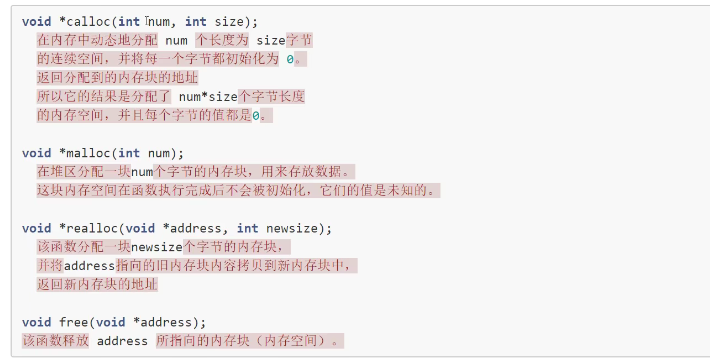

# 06C 程序之动态内存分配

解决内存浪费问题

第一次分配

```c

#include <stdio.h>
#include <malloc.h>

// molloc 动态内存分配函数

int main() {
// 3*sizeof(int) 3个int大小的内存
	// malloc向操作系统申请动态内存  堆存储区  返回是void 是无类型的
	// int  进行强制类型转化
	int *p = (int *)malloc(3*sizeof(int));  // p指向3个内存空间的整型

	*p = 20; //p指向第一个
	*(p+1) = 30; // p指针+1 指向第二个
	p[2] = 40; //下标方式获取

	for(int i=0;i<3;i++){
		printf("%d \n", p[i]); // p[i]相当于 *(p + i)
	}

	//动态内存释放
	free(p);
}
```




```c


#include <stdio.h>
#include <malloc.h>

// molloc 动态内存分配函数

int main() {
// 3*sizeof(int) 3个int大小的内存
	// malloc向操作系统申请动态内存  堆存储区  返回是void 是无类型的
	// int  进行强制类型转化
	int *p = (int *)malloc(3*sizeof(int));  // p指向3个内存空间的整型

	*p = 20; //p指向第一个
	*(p+1) = 30; // p指针+1 指向第二个
	p[2] = 40; //下标方式获取

	// for(int i=0;i<3;i++){
	// 	printf("%d \n", p[i]); // p[i]相当于 *(p + i)
	// }

    // 重新分配
	// realloc将旧数据copy到新空间，把旧的空间释放

	p = (int *)realloc(p, 5*sizeof(int)); // 在原来p的基础上，分配至 5 个

	p[3] = 50;


	for(int i=0;i<5;i++){
		printf("%d \n", p[i]); // p[i]相当于 *(p + i)
	}

	//动态内存释放
	free(p);
}
```

```c
// 动态分配学生成绩的内存
#include <stdio.h>
#include <string.h>
#include <malloc.h>

struct Student
{
	char name[10];
	int age;
	double score;
};

void Scanf2(struct Student *stu) {
	printf("请输入 姓名、年龄、分数\n");
	scanf("%s", stu->name);
	scanf("%d", &(stu->age));
	scanf("%lf", &(stu->score));
	// printf("姓名%s 年龄%d 成绩%lf\n", stu->name,stu->age,stu->score);

}

int main() {
	struct Student *students = 0; 
	struct Student *p = 0, *q = 0; // q是指针 

	int n = 0,cap; //cap由用户定义设置几个指针容量
	// 
	scanf("%d", &cap);
	students = (struct Student *)malloc(cap*sizeof(struct Student));
	// int *p = (int *)malloc(3*sizeof(int));  // p指向3个内存空间的整型

	if(!students) {
		printf("初始化动态内存失败");
		return 1;
	}

	p = students; // p指向students的第一个

	while(1){
		Scanf2(p);
		if(p->age<0) {
			break;
		}
		n++;
		p++;
		if(n==cap) { // 空间满了
			printf("空间已满，内存增加一倍\n");
			cap *= 2;
			students = (struct Student *)realloc(students, cap*sizeof(struct Student));
			if (!students) {
				printf("初始化动态内存失败");
				return 2;
			}
			p = students + n; // 下一个p 指向新空间的下一个  
		}
	}

	q = students + n; // q指针的值为students的n个后面的第一个
	for(p=students;p<q;p++){ // 指针p指向students的第一个元素的地址  
		printf("姓名%s 年龄%d 成绩%lf\n", p->name,p->age,p->score);
	}

	free(students);
	return 0;
}
```

