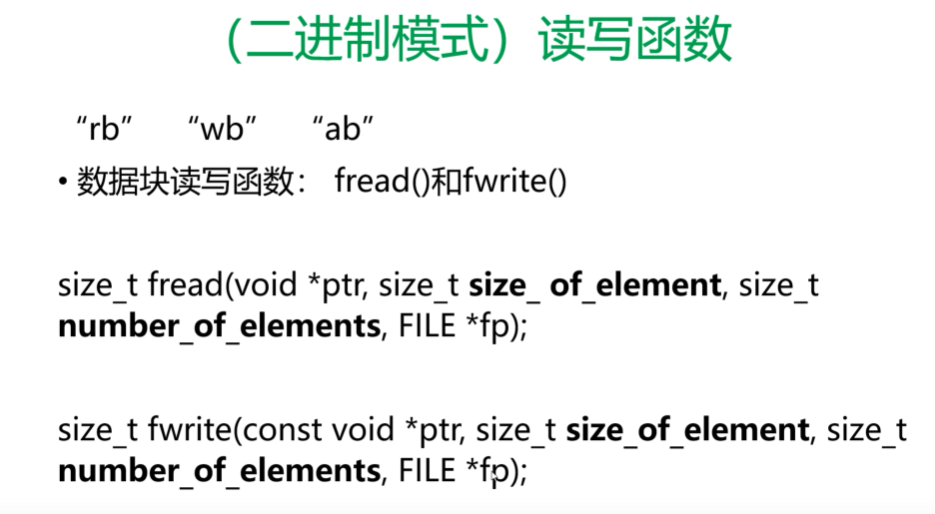

# 06C 程序之文件读写

## 一、打开文件


模式


## 二、关闭文件


## 三、fscanf（读文件）、fprintf(写入文件)


```c
// 打开单个文件，写入数据，并读取出来
#include <stdio.h>
int main() {
	char name[10];
	float score;

	FILE *fp;
	fp = fopen("test.txt", "w");

	if(fp==0) {
		printf("打开文件失败!\n");
		return 1;
	}

	// 写入数据
	fprintf(fp, "LiPing 78.5\n");
	fprintf(fp, "%s %f", "Wang", 55.4); // 写入数据
	fclose(fp);

	fp = fopen("test.txt", "r");
	fscanf(fp, "%s %f", name, &score); // 读取文件
	printf("%s %f\n", name, score);
	fscanf(fp, "%s %f", name, &score); // 读取文件
	printf("%s %f\n", name, score);
	// fscanf(fp, "%s %f", name, &score);
}
```

复制文件

```c

#include <stdio.h>
int main() {

	FILE *fp,*fw;

	struct Student {
		char name[20];
		int id;
		float score;
	};

	struct Student s;

	fp = fopen("stu1.txt", "r");
	fw = fopen("stu2.txt", "w");

	// 字符串数组本身就是地址。 EOF 文件结束符
	while(fscanf(fp, "%s%d%f", s.name, &s.id, &s.score) != EOF){
		fprintf(fw, "%s %d %f \n", s.name, s.id, s.score);
		printf("%s %d %f \n", s.name, s.id, s.score);
	}

	fclose(fp);
	fclose(fw);

}
```

## 四、一个一个字符进行读写


```c

#include <stdio.h>
int main() {

	FILE *fp;
	char ch;
	fp = fopen("getc_putc.txt", "w");
	printf("输入你们的数据\n");
	while ((ch = getchar()) != EOF) { // getchar  从键盘读取一个字符
		putc(ch,fp); // 把字符写入fp文件
	}
	fclose(fp); // 关闭文件，所有数据都写入
	fp = fopen("getc_putc.txt", "r");
	while ((ch = getc(fp)) != EOF) { // getc  从文件中读取字符
		printf("%c\n", ch);
	}

	fclose(fp);
	return 0;

}
```

## 五、一行一行的读写


```c

#include <stdio.h>
int main() {

	FILE *fp;
	char str[100];
	fp = fopen("getc_putc.txt", "w");
	printf("输入你们的数据\n");
	while (gets(str) != NULL) { // gets 从键盘读取一行字符串    
		fputs(str,fp); // 把字符写入fp文件
		// 加入换行符  !!注意这里
		// putc('\n',fp);
	}
	fclose(fp); // 关闭文件，所有数据都写入
	fp = fopen("getc_putc.txt", "r");
	while (fgets(str, 100, fp) != NULL) { // fgets  从文件中读取字符,读取99个字符，最后第100个是 '\0'
		printf("%s\n", str);
	}

	fclose(fp);
	return 0;

}
```

## 六、二进制模式读写




```c


#include <stdio.h>
int main() {

	FILE *fp;

	struct Student {
		char name[20];
		int id;
		float score;
	};

	struct Student s;

	fp = fopen("stu.bin", "wb"); // 二进制 写 方式打开

	while(scanf("%s%d%f", s.name, &s.id, &s.score) != EOF){ // 普通键盘输入
		fwrite(&s, sizeof(struct Student), 1, fp);  // s的地址  student的内存大小 1个 文件  fwrite二进制写方法
	}
	fclose(fp);

	fp = fopen("stu.bin", "rb"); // 二进制 读 方式打开
	while(fread(&s, sizeof(struct Student), 1, fp) == 1) { // fread二进制读方法
		printf("%s %d %f", s.name, s.id, s.score);
	}
	fclose(fp);

}
```

特殊函数


```c


#include <stdio.h>
#include <string.h>
int main() {
	long filesize;
	FILE *fp;

	struct Student {
		char name[20]; // 20字节
		int id; // 4字节
		float score; // 4字节
	};

	struct Student s, s2;
	strcpy(s.name, "Li Ping");
	s.id = 13023;
	s.score = 66.56;

	fp = fopen("file.txt", "wb+"); // 二进制 + 写,读 方式打开

	fwrite(&s, sizeof(struct Student), 1, fp); // 把s写到fp中

	filesize = ftell(fp); // 查看当前文件位置
	printf("文件的当前位置是：%ld\n", filesize);

	fseek(fp, 0, SEEK_SET); // SEEK_SET--开头

	filesize = ftell(fp); // 查看当前文件位置
	printf("文件的当前位置是：%ld\n", filesize);

	fread(&s2, sizeof(struct Student), 1, fp); // 从fp中读取一个student到s2里面
	printf("%s %d %f\n", s2.name, s2.id, s2.score);

	filesize = ftell(fp); // 查看当前文件位置
	printf("文件的当前位置是：%ld\n", filesize);

	fclose(fp);

}
```


