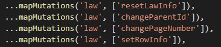
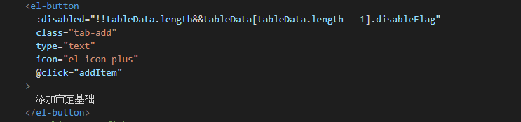
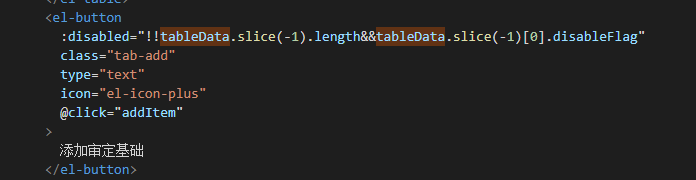
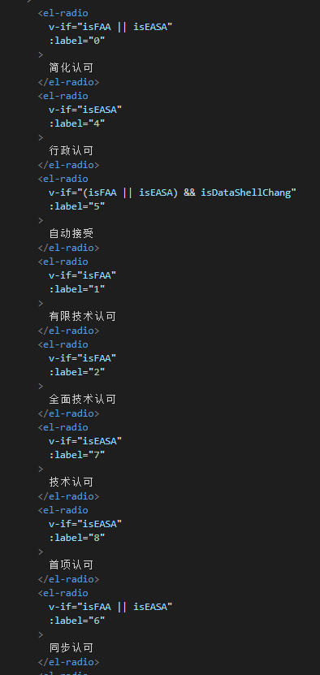
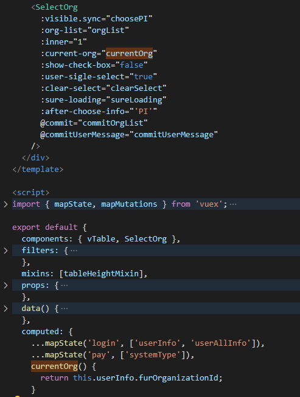
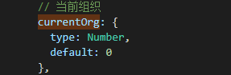

# 代码Review-20210125

## 1、vuex语法



mapMutation是什么？

```javascript
/**
 * Reduce the code which written in Vue.js for committing the mutation
 * @param {String} [namespace] - Module's namespace
 * @param {Object|Array} mutations # Object's item can be a function which accept `commit` function as the first param, it can accept anthor params. You can commit mutation and do any other things in this function. specially, You need to pass anthor params from the mapped function.
 * @return {Object}
 */
export const mapMutations = normalizeNamespace((namespace, mutations) => {
  const res = {}
  normalizeMap(mutations).forEach(({ key, val }) => {
    res[key] = function mappedMutation(...args) {
      // Get the commit method from store
      let commit = this.$store.commit
      if (namespace) {
        const module = getModuleByNamespace(
          this.$store,
          'mapMutations',
          namespace
        )
        if (!module) {
          return
        }
        commit = module.context.commit
      }
      return typeof val === 'function'
        ? val.apply(this, [commit].concat(args))
        : commit.apply(this.$store, [val].concat(args))
    }
  })
  return res
})
```


首先也是申明 res 空对象，经过 normalizeMap 函数处理后的 mutations 调用 forEach 循环处理，在 forEach 的回调函数中， 使用解构取出 key 和 value，每一次循环就以 key 为键、mappedMutation 函数为 value 存入 res 对象， 在 mappedMutation 函数中，声明 commit 变量保存 this.$store.commit 。

判断传入的 namespace，如果有 namespace 就调用 getModuleByNamespace 函数搜索对应模块，如果没有搜索到就 return，有对应模块的话对应模块的将 commit 赋值给声明的 commit 变量。

mappedMutation 最后判断 val 是否是 function，是就调用 apply 将 val 的 this 绑定到 Vue 实例，并将 commit 和 args 合并成一个数组作为参数传递，，val 不是 function 就将 commit 调用 apply 改变了 this 指向，将 val 和 args 合并成一个数组作为参数传递，执行后返回。

最后将 res 对象返回。

[辅助函数参考文章](https://www.yuque.com/fe9/basic/aivfqs)

```javascript
/**
 * 标准化map
 * normalizeMap([1,2]) => [{key:1, val:1}, {key:2, val:2}];
 * normalizeMap({a: 1, b: 2}) => [{key: 'a', val: 1}, {key: 'b', val:2}];
 * @param {Array | Object} map 
 * @return { Array }
 */
function normalizeMap(map) {
  if (!isValidMap(map)) return;
  
  return Array.isArray(map) ? map.map(key => ({ // 数组
    key,
    val: key,
  })) : Object.keys(map).map(key => ({  // 不是数组, 对象
    key,
    val: map[key],
  }))
}

/**
 * 校验Map 是否合法
 * @param {*} map 
 * @return {Boolean}
 */
function isValidMap(map) {
 return Array.isArray(map) || isObject(map);
}
```

## 2、Array 使用length时 注意 判断数组长度是否为0



**如何获取数组最后一个元素？**

- length方法
- slice([startIndex],[endIndex])  

 特点：不改变原数组，返回<font color="red"> 新数组 </font>

可以接收1或2个参数

1个-----从index到数组末尾

2个-----从startIndex到endIndex，包含起始，不包含结尾（左闭右开）



若index为负值，将负值加上数组长度进行计算

- pop() 

特点：改变原数组，返回最后一个元素的值

pop() 方法用于删除并返回数组的最后一个<font color="red"> 元素的值 </font>，减少数组的 length 值。

## 3、html中dom重复时，尽量用循环展示



- 选项用数组进行遍历
- 选项中包含v-if的，可以使用filter进行过滤

## 4、Props

父组件



子组件中



- 合理利用default进行赋值
- 结合实际情况，当props参数过多可用对象进行传递


