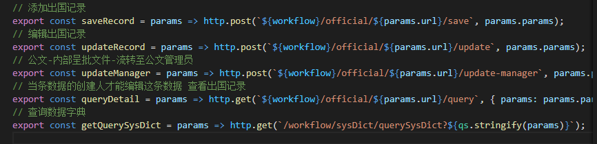
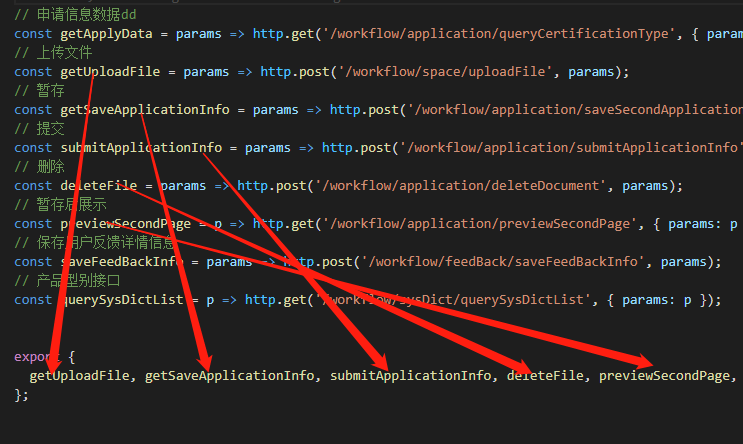
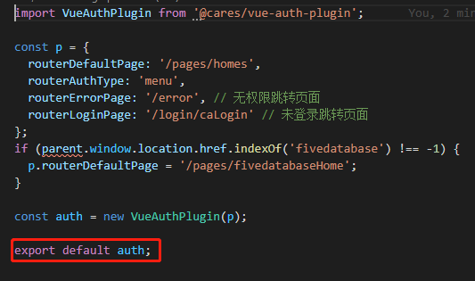
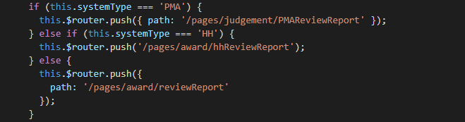
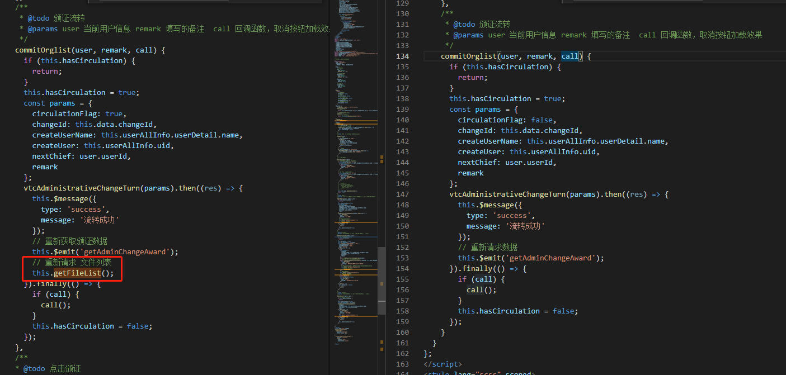
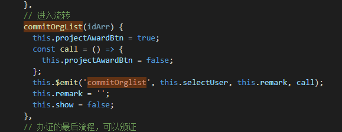
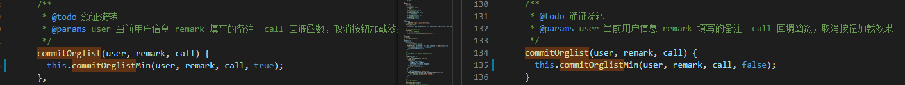

# 代码Review-20210222

## 1.export和import

命名导出-----命名导入





默认导出---默认导入（默认导出就好像整个模块就是导出的值一样）



```javascript
// 第一种
export function a() {
    console.log('a')
}
export function b() {
    console.log('b')
}
export function c() {
    console.log('c')
}
const d = 'd'

export default d;

// 第二种
function a() {
    console.log('a')
}
function b() {
    console.log('b')
}
function c() {
    console.log('c')
}
const d = 'd'

export default {a, b, c, d};

```

```javascript
import util from './utils'
console.log(util);
// 第一种
// d
// 第二种
// {a: ƒ a(), b: ƒ b(), c: ƒ c(), d: "d"}
```


## 2.keep-alive

需求：审定列表返回时分页数据不变；tabs切换时，页面不刷新

[keep-alive](https://cn.vuejs.org/v2/api/#keep-alive)

## 3.避免使用过多的if判断



```javascript
// 将判断条件和进行的操作进行映射
const obj = {'PMA': '/pages/judgement/PMAReviewReport', 'HH': '/pages/award/hhReviewReport'}
// 默认的操作
const goPath = obj[this.systemType] || '/pages/award/reviewReport';
this.$router.push(goPath);
```

## 4.同一个方法的多次调用

父组件：两个父组件



子组件：为同一个组件



解决方案：使用mixin

方法1.在commitOrglist方法中进行调用mixin里面的方法commitOrglistMin，一个传入ture，一个传入false



```javascript
commitOrglistMin(user, remark, call, flag) {
    if (this.hasCirculation) {
        return;
    }
    this.hasCirculation = true;
    const params = {
        circulationFlag: true,
        changeId: this.data.changeId,
        createUserName: this.userAllInfo.userDetail.name,
        createUser: this.userAllInfo.uid,
        nextChief: user.userId,
        remark
    };
    vtcAdministrativeChangeTurn(params).then((res) => {
        this.$message({
            type: 'success',
            message: '流转成功'
        });
        // 重新获取颁证数据
        this.$emit('getAdminChangeAward');
        // 重新请求 文件列表
        if (flag) {
           this.getFileList();
         }
    }).finally(() => {
        if (call) {
            call();
        }
        this.hasCirculation = false;
    });
}
      
```

方法2.直接调用mixin里面的方法

```javascript
commitOrglist(user, remark, call) {
    if (this.hasCirculation) {
        return;
    }
    this.hasCirculation = true;
    const params = {
        circulationFlag: true,
        changeId: this.data.changeId,
        createUserName: this.userAllInfo.userDetail.name,
        createUser: this.userAllInfo.uid,
        nextChief: user.userId,
        remark
    };
    vtcAdministrativeChangeTurn(params).then((res) => {
        this.$message({
            type: 'success',
            message: '流转成功'
        });
        // 重新获取颁证数据
        this.$emit('getAdminChangeAward');
        // 重新请求 文件列表
        if (this.getFileList) {
           this.getFileList();
         }
    }).finally(() => {
        if (call) {
            call();
        }
        this.hasCirculation = false;
    });
}
```

## 5.this.getFileList和this.getFileList() 区别

[方法和方法引用](https://blog.csdn.net/weixin_30787531/article/details/98838997?utm_medium=distribute.pc_relevant.none-task-blog-baidujs_title-3&spm=1001.2101.3001.4242)

