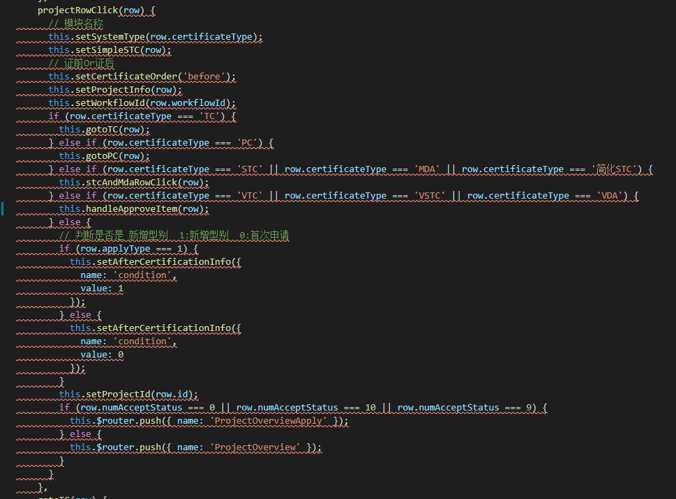
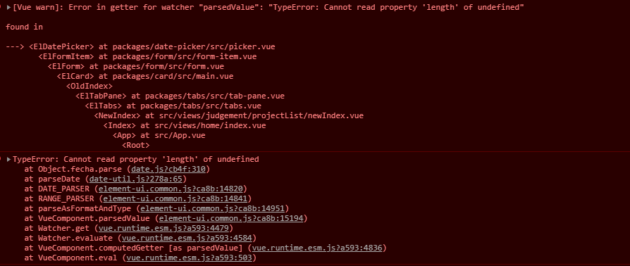
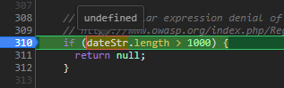
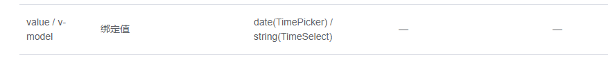

# 代码Review-20210301
## 1.复杂度过高



解决方案

- 提取方法，将if判断进行分散  例：this.gotoTC(row); this.gotoPC(row);
- 修改判断条件

```javascript
// 原代码
row.certificateType === 'STC' || row.certificateType === 'MDA' || row.certificateType === '简化STC'
修改后
['STC', 'MDA', '简化STC'].includes(row.certificateType)
```


- 恰当地使用Object、Map数据结构

```javascript
const mapData = new Map([["TC", tctodo], ['PC', pctodo]])
// 判断有没有row.certificateType    mapData.has(xx)
// map.get(xxx)
```

## 2.媒体查询可删除

```css
@media screen and (max-width: 1400px) {
.bilateralTable {
    width: 69.5%;
    margin-left: 340px;
  }
}
```

- 媒体查询种类 screen print all
- 媒体查询操作符 and  ,(或)，not，only

## 3.组件数据初始化

数据初始化报错信息





查文档，发现绑定值只支持date和string



经分析是初始化赋值问题，找代码

```javascript
this.timeSelect = [val.startTime, val.endTime];
修改为
this.timeSelect = [val.startTime || '', val.endTime || ''];
```

## 4.数据结构&JS方法

```javascript
const arr = [
    {"id":674,"workflowId":"dde4aa6f-77f7-11eb-8f7a-525400805f02"},
    {"id":675,"workflowId":"dde4aa6f-77f7-11eb-8f7a-525400805f02"},
    {"id":676,"workflowId":"dde4aa6f-77f7-11eb-8f7a-525400805f02"}
]
const obj = {674: false, 675: true, 676: false}
// todo 通过js编写形成下面的数据结构
const arr = [
    {"id":674,"workflowId":"dde4aa6f-77f7-11eb-8f7a-525400805f02", flag: false},
    {"id":675,"workflowId":"dde4aa6f-77f7-11eb-8f7a-525400805f02", flag: true},
    {"id":676,"workflowId":"dde4aa6f-77f7-11eb-8f7a-525400805f02", flag: false}
]
```

- 特征是什么？
- 遍历谁？
- 两个数据结构之间的关系？
- 遍历之后要做什么操作？

```
// arr原有数组被改变
// arr发生改变 遍历arr
// id 一样
// 通过id找到obj里面的对应id的值，给item赋值上
arr.forEach((item) => {
	item.flag = obj[item.id];
});
```


