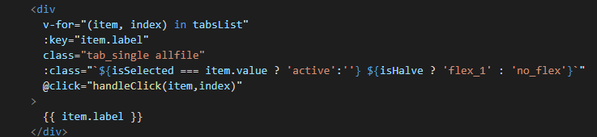
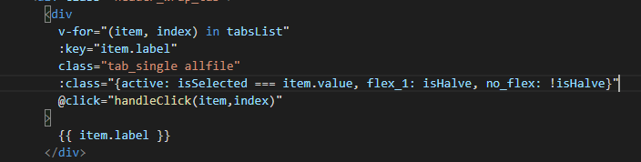
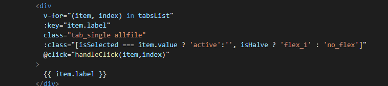
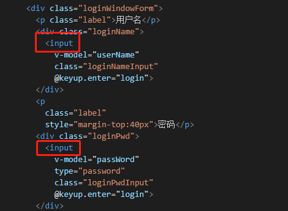
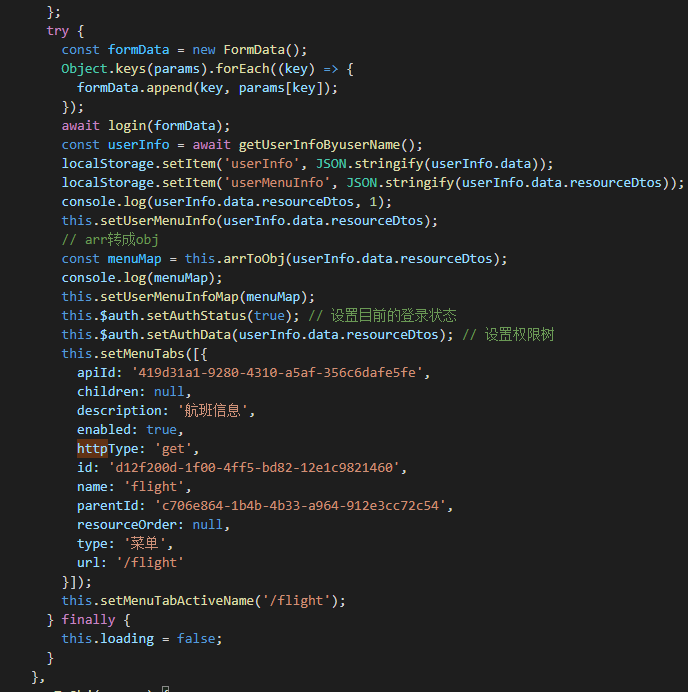
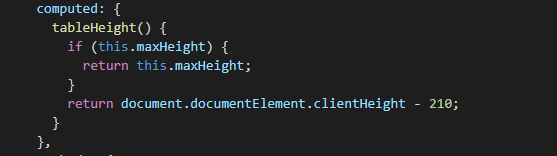
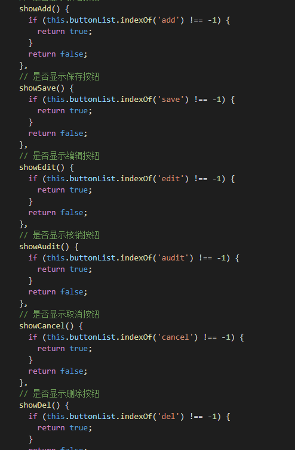

# 代码review20210308

## 1.class动态绑定语法



```javascript
// 对象形式
:class="{active: isSelected === item.value, flex_1: isHalve, no_flex: !isHalve}"
```



```javascript
// 数组形式
:class="[isSelected === item.value ? 'active':'', isHalve ? 'flex_1' : 'no_flex']"
```



## 2. 结合饿了么组件使用，避免原生html



## 3.try…catch…finally



## 4.一个if用三目运算符替换



```javascript
// 修改后   
tableHeight() {
    return this.maxHeight ? this.maxHeight : (document.documentElement.clientHeight - 210);
}
```

## 5.优雅的返回boolean值



```javascript
    // 巧用boolean值
    showAdd() {
        return this.buttonList.indexOf('add') !== -1;
        // if (this.buttonList.indexOf('add') !== -1) {
        //    return true;
        // }
        // return false;
    },
```

