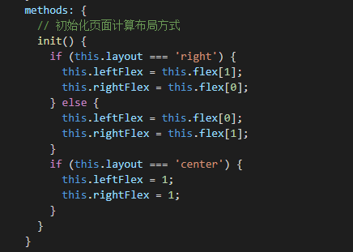
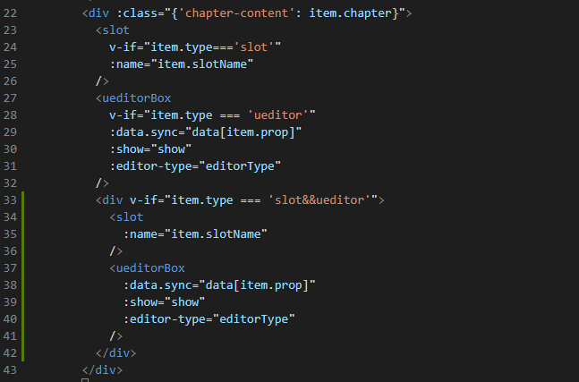
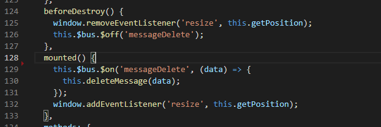
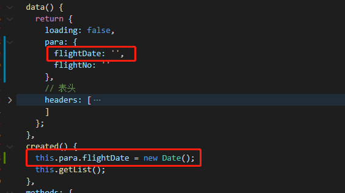
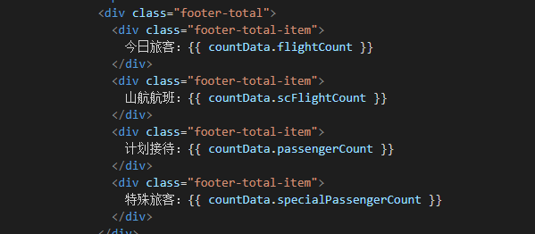
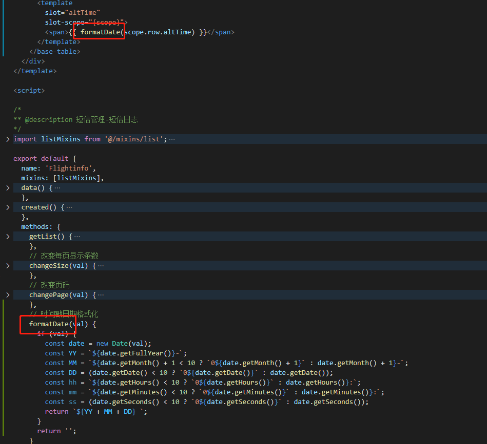

# 代码 review20210322

## 1.if……else…… && if……else if……else……





## 2. addEventListener 和 removeEventListener



```JavaScript
    // 通过hook监听组件销毁钩子函数，并取消监听事件1
    this.$once('hook:beforeDestroy', () => {
      window.removeEventListener('resize', this.getPosition);
      this.$bus.$off('messageDelete');
    });
```

## 3.常见错误





## 4.filters 使用



时间格式化，可以注册全局的 filter，在全局使用，参考 amos

```javascript
// filter全局注册       main.js中
Vue.filter("emptyText", emptyText);
```

## 5.vscode 代码格式化校验

- Vetur
- Prettier
- Eslint
