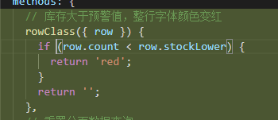

# 代码 review20210412

## 1.解构赋值

提取json数据


```javascript
const { processList, amosPcCertificateChangeEntity, parentId, certificateNumber } = res.data;
this.processList = processList || [];
if (this.processList.length > 2) {
    this.hasPE = amosPcCertificateChangeEntity.productInspectorId;
}
this.headerData = amosPcCertificateChangeEntity;
this.parentId = parentId || null;
this.projectName = amosPcCertificateChangeEntity.projectName;
this.productStatus = amosPcCertificateChangeEntity.approvalStatus;
this.designId = this.processList[0].designId;
this.setLimitStatus(amosPcCertificateChangeEntity.approvalStatus);
this.setCertificateNumber(certificateNumber);
this.setParentId(parentId);
this.setPayBasicData(amosPcCertificateChangeEntity);
// 产品名称
this.setProductName(amosPcCertificateChangeEntity.productName);
// 申请人姓名
this.setApplyUserName(amosPcCertificateChangeEntity.createUserName);
```

## 2. 行内样式不支持px

如果样式不符合，修改到行内样式的时候发现想px，把px改成rem试试效果，如果效果不佳，再修改值，并且把单位改成rem。


## 3.代码书写逻辑问题-写好提交记录

两个路径指向同一个页面，何必要换路径呢？


## 4.addEventListener 和 removeEventListener 仍未改

## 5.三目运算符



## 6.代码优化

证后表格，选择PE、PI模块组件抽取---韩歆瑀

commitId：350a4f68f18ec56a870519cf85a96f3a1920fba6


