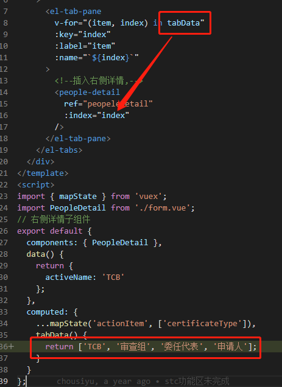
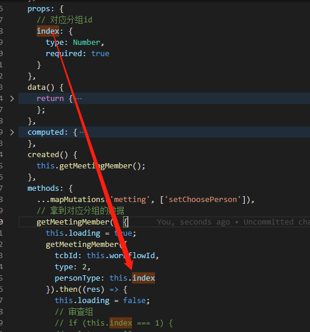
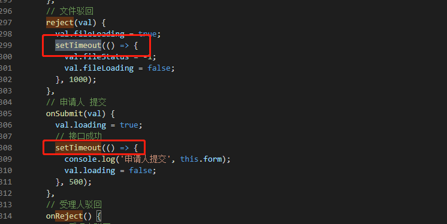

# 代码 review20210517

## 1.遍历数据





1.定义数据用data，别用computed

2.遍历数据时用object，少用Array

3.传参时禁止用index传参自己封装值

## 2.节流和防抖

[节流防抖](https://juejin.cn/post/6962949488646291486)

```javascript
function throttle(func, delay) {
    var last = 0;
    return function () {
        var now = Date.now();
        if (now >= delay + last) {
		console.log(arguments);
            func.apply(this, arguments);
            last = now;
        } else {
            console.log("距离上次调用的时间差不满足要求哦");
        }
    }
}

function resize(...arg) {
    console.log("窗口大小改变了", e);
}
window.addEventListener('resize', throttle(resize, 500));
```


```javascript
// 防抖
function success(...arge) {
      console.log("成功");
      console.log(arge);
    }
    //定义一个修饰函数用来处理传进的函数 需要处理的函数,触发的时间
    function debounce(fn, time) {
      var timer = null;
      return function(arge) {
        clearTimeout(timer);
        timer = setTimeout(function() {
           // fn.call(this, 200, 556624, 22); //传递多个参
          fn.apply(this, [200, 556624, 22]); //传递多个参
        }, time);
      };
    }

    window.addEventListener("click", debounce(success, 1000));
```


对于函数防抖，有以下几种应用场景：

　　（1）给按钮加函数防抖防止表单多次提交。

　　（2）对于输入框连续输入进行AJAX验证时，用函数防抖能有效减少请求次数。

　　（3）判断 scroll 是否滑到底部， 滚动事件 + 函数防抖

总的来说，适合**多次事件，一次响应**的情况

对于函数节流，有如下几个场景：

　　（1）游戏中的刷新率

　　（2）DOM元素拖拽

　　（3）Canvas画笔功能

总的来说，适合**大量事件按时间做平均分配触发**。

## 3.内存泄露



## 

及时清除定时器和事件监听

