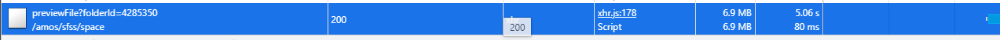

# 记一次浏览器访问太慢的解决方法20210720

## 1.js、css、接口请求、img

```nginx
    gzip on;
    gzip_disable "msie6";
    gzip_static on;

    gzip_vary on;
    gzip_proxied any;
    gzip_comp_level 6;
    gzip_buffers 4 32k;
    gzip_http_version 1.1;
    gzip_min_length 1k;
    gzip_proxied expired no-cache no-store private auth;
    gzip_types image/png application/octet-stream text/plain text/css application/json application/javascript application/xml application/xml+rss text/javascript application/vnd.ms-fontobject application/x-font-ttf font/opentype image/svg+xml image/x-icon;

```

## 2.图片过大



换小图片

## 3.按需引入

[ElementUI按需引入](https://element.eleme.cn/#/zh-CN/component/quickstart)

[vxe-table按需引入](https://xuliangzhan_admin.gitee.io/vxe-table/#/table/start/use)

## 4.动态引入

vue-router中动态引入组件

js语法中

```javascript
//heollo.js
export function hello(){
    console.log('hello')
}

// 导入js文件中 静态导入  不管用不用 先导入再说
// import * as m1 from './hello.js'
const btn = document.querySelector("#btn")
btn.onclick = function(){
    // 动态导入
    import('./hello.js').then(module=>{
        // module 就是模块里面导出的对象
        module.hello()
    })
}

```


