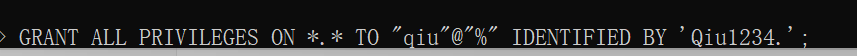

# vue+koa+mysql 项目

## 1.mysql 安装

查看有无 mysql 服务


查看 mysql 状态


想要重启 mysql，发现 我没有 mysql = =！


下面 在 linux 中安装 mysql 吧！

- 实例规格：ecs.c6.large（2 vCPU，4 GiB 内存）

- 操作系统：公共镜像 CentOS 7.2 64 位

- MySQL：5.7.33

  本示例中，MySQL 相关安装路径说明如下：

  - 配置文件：/etc/my.cnf
  - 数据存储：/var/lib/mysql
  - 命令文件：/usr/bin 和/usr/sbin

- 数据库端口：3306

第一步、运行以下命令更新 YUM 源。


第二步、运行以下命令安装 MySQL。

yum -y install mysql-community-server

第三步、返回以下结果代表部署成功


## 配置 MySQL

1. 运行以下命令启动 MySQL 服务。

   ```sql
   systemctl start mysqld
   ```

2. 运行以下命令设置 MySQL 服务开机自启动。

   ```bash
   systemctl enable mysqld
   ```

3. 运行以下命令查看/var/log/mysqld.log 文件，获取并记录 root 用户的初始密码。

   ```javascript
   grep 'temporary password' /var/log/mysqld.log
   
   // 输出：2021-12-24T06:42:03.043057Z 1 [Note] A temporary password is generated for root@localhost: yKig=e:\_U1Bq
   ```


1. 创建mysql用户

   

2. 授权

   

3. 刷新权限

   

4. 


参考链接[mysql增加新用户](https://www.cnblogs.com/fangjb/p/13652551.html)