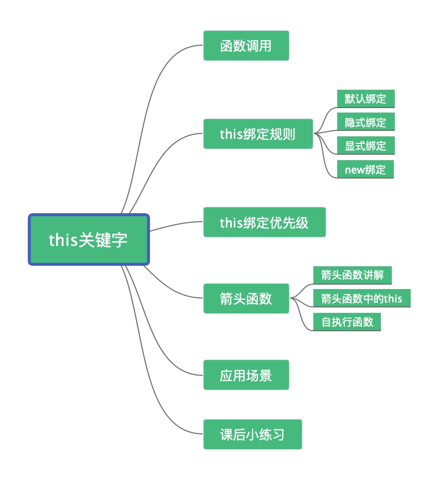
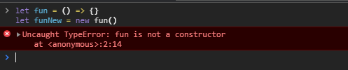
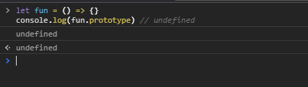

# this关键字

## 文章概览图



## 面试题

```javascript
var a = 5;
var obj = {
  a : 10,
  foo: function(){
    console.log(this.a)
  }
}

var bar = obj.foo
obj.foo()
bar()
```


## 函数调用&&形式

JS里面的三种函数调用形式：

下文中前两种方式都是语法糖，可通过call进行方法转化

```javascript
func(p1, p2)
obj.child.method(p1, p2)
func.call(context, p1, p2)

// 调用方法转化 
func.call(undefined, p1, p2)
obj.child.method.call(obj.child, p1, p2)
func.call(context, p1, p2)

// 本质
func.call(context, p1, p2)
```


## 答案

obj.foo() 转为call的形式就是 obj.foo.call(obj) ，所以this指向了obj，输出结果是10。

bar()转化为call的形式是bar.call(undefined)，由于没有传context，所以this就是undefined。如果在浏览器中，默认的this就是window对象；在Node.js环境中默认的this就是global对象。所以在浏览器中运行结果为5，在Node.js环境中为undefined。

## []语法中的 this 关键字

```javascript
function fn() {
  console.log(this)
}
var arr = [fn, fn2]
arr[0]() // 这里面的 this 又是什么呢？
```

 arr[0] 想象成arr.0，进行转化=>arr.0.call(arr)

```
        arr[0]()
假想为    arr.0()
然后转换为 arr.0.call(arr)
那么里面的 this 就是 arr 了
```

## this的绑定原则

### 一、默认绑定

默认绑定是函数针对的独立调用的时候，不带任何修饰的函数引用进行调用，非严格模式下 this 指向全局对象(浏览器下指向 Window，Node.js 环境是 Global ），严格模式下，this 绑定到 undefined ,严格模式不允许 this 指向全局对象。

```javascript
var a = 'hello'

var obj = {
  a: 'koala',
  foo: function() {
    console.log(this.a)
  },
}

var bar = obj.foo

bar() // 浏览器中输出: "hello" 
```

`bar()`就是默认绑定，函数调用的时候，前面没有任何修饰调用，也可以用之前的 `call`函数调用形式理解，所以输出结果是`hello`。

### 默认绑定的另一种形式

在函数中以函数作为参数传递，例如`setTimeOut`和`setInterval`等，这些函数中传递的函数中的`this`指向，在非严格模式指向的是全局对象。

```javascript
var name = 'koala'
var person = {
  name: '程序员成长指北',
  sayHi: sayHi,
}
function sayHi() {
  setTimeout(function() {
    console.log('Hello,', this.name)
  })
}
person.sayHi()
setTimeout(function() {
  person.sayHi()
}, 200)
// 输出结果 Hello,koala
// 输出结果 Hello,koala 
```


### 二、隐式绑定

判断 this 隐式绑定的基本标准:函数调用的时候是否在上下文中调用，或者说是否某个对象调用函数。

```javascript
var a = 'koala'

var obj = {
  a: '程序员成长指北',
  foo: function() {
    console.log(this.a)
  },
}
obj.foo() // 浏览器中输出: "程序员成长指北" 
```


### 隐式绑定的另一种形式

当有多层对象嵌套调用某个函数的时候，如 `对象.对象.函数`,this 指向的是最后一层对象。

```javascript
function sayHi() {
  console.log('Hello,', this.name)
}
var person2 = {
  name: '程序员成长指北',
  sayHi: sayHi,
}
var person1 = {
  name: 'koala',
  friend: person2,
}
person1.friend.sayHi()

// 输出结果为 Hello, 程序员成长指北 
```

### 三、显示绑定

显式绑定，通过函数 call apply bind 可以修改函数 this 的指向。call 与 apply 方法都是挂载在 Function 原型下的方法，所有的函数都能使用。

####  call 和 apply 的区别

1. call 和 apply 的第一个参数会绑定到函数体的 this 上，如果`不传参数`，例如`fun.call()`，非严格模式，this 默认还是绑定到全局对象

2. call 函数接收的是一个参数列表，apply 函数接收的是一个参数数组。

   ```javascript
   func.call(thisArg, arg1, arg2, ...)        // call 用法
   func.apply(thisArg, [arg1, arg2, ...])     // apply 用法
   ```

   看代码例子

   ```javascript
   var person = {
     'name': 'koala',
   }
   function changeJob(company, work) {
     this.company = company
     this.work = work
   }
   
   changeJob.call(person, '百度', '程序员')
   console.log(person.work) // '程序员'
   
   changeJob.apply(person, ['百度', '测试'])
   console.log(person.work) // '测试' 
   ```

#### call和apply的注意点

这两个方法在调用的时候，如果我们传入数字或者字符串，这两个方法会把传入的参数转成对象类型。

```javascript
var number = 1, string = '程序员成长指北'
function getThisType() {
  var number = 3
  console.log('this指向内容', this)
  console.log(typeof this)
}
getThisType.call(number)
getThisType.apply(string)
// 输出结果
// this指向内容 [Number: 1]
// object
// this指向内容 [String: '程序员成长指北']
// object 
```

#### bind函数

::: 提醒

bind 方法 会创建一个新函数。当这个新函数被调用时，bind() 的第一个参数将作为它运行时的 this，之后的一序列参数将会在传递的实参前传入作为它的参数。(定义内容来自于 MDN )

:::

```javascript
func.bind(thisArg[, arg1[, arg2[, ...]]])    // bind 用法
```

例子

```javascript
var publicAccounts = {
  name: '程序员成长指北',
  author: 'koala',
  subscribe: function(subscriber) {
    console.log(subscriber + this.name)
  },
}

publicAccounts.subscribe('小红') // 输出结果: "小红 程序员成长指北"

var subscribe1 = publicAccounts.subscribe.bind(
  { name: 'Node成长指北', author: '考拉' },
  '小明 '
)
subscribe1() // 输出结果: "小明 Node成长指北"

```

### 四、new绑定

使用 new 调用函数的时候，执行流程：

1. 创建一个空对象
2. 将空对象的 *proto* 指向原对象的 prototype
3. <font color="red">执行构造函数中的代码</font>
4. 返回这个新对象

```javascript
function study(name) {
  this.name = name
}
var studyDay = new study('koala')
console.log(studyDay)
console.log('Hello,', studyDay.name)
// 输出结果
// study { name: 'koala' }
// hello，koala

```


### 手动实现一个 new 创建对象代码(多种实现方式哦)

```javascript
function New(func) {
  var res = {}
  if (func.prototype !== null) {
    res.__proto__ = func.prototype
  }
  var ret = func.apply(res, Array.prototype.slice.call(arguments, 1))
  if ((typeof ret === 'object' || typeof ret === 'function') && ret !== null) {
    return ret
  }
  return res
}
var obj = New(A, 1, 2)
// equals to
var obj = new A(1, 2)

```

##  this 绑定优先级


上面介绍了 this 的四种绑定规则，但是一段代码有时候会同时应用多种规则，这时候 this 应该如何指向呢？其实它们也是有一个先后顺序的，具体规则如下:

**new 绑定 > 显式绑定 > 隐式绑定 > 默认绑定**

## 箭头函数中的 this

### 箭头函数

在讲箭头函数中的 this 之前，先讲一下箭头函数。

::: tip

MDN:箭头函数表达式的语法比函数表达式更短，并且不绑定自己的 this，arguments，super 或 new.target。这些函数表达式最适合用于非方法函数(non-method functions)，并且它们不能用作构造函数。

:::

+ 箭头函数中没有 arguments

常规函数可以直接拿到 arguments 属性，但是在箭头函数中如果使用 arguments 属性，拿到的是箭头函数外层函数的 arguments 属性。

```javascript
function constant() {
  return () => arguments[0]
}

let result = constant(1)
console.log(result()) // 1

```

**如果我们就是要访问箭头函数的参数呢？**

你可以通过 ES6 中 命名参数 或者 rest 参数的形式访问参数

```javascript
let nums = (...nums) => nums
```

+ 箭头函数没有构造函数

箭头函数与正常的函数不同，箭头函数没有构造函数 constructor，因为没有构造函数，所以也不能使用 new 来调用，如果我们直接使用 new 调用箭头函数，会报错。



+ 箭头函数没有原型

+ 

原型 prototype 是函数的一个属性，但是对于箭头函数没有它。



+ 箭头函数中没有 super

上面说了没有原型，连原型都没有，自然也不能通过 super 来访问原型的属性，所以箭头函数也是没有 super 的，不过跟 this、arguments、new.target 一样，这些值由外围最近一层非箭头函数决定。

+ <font color="red">箭头函数中没有自己的this</font>

  箭头函数中没有自己的 this，箭头函数中的 this 不能用 call()、apply()、bind() 这些方法改变 this 的指向，箭头函数中的 this 直接指向的是`调用函数的 上一层运行时。

  ```javascript
  let a = 'kaola'
  
  let obj = {
    a: '程序员成长指北',
    foo: () => {
      console.log(this.a)
    },
  }
  
  obj.foo() // 输出结果: "koala"
  ```

  看完输出结果，怕大家有疑问还是分析一下，前面我说的箭头函数中 this 直接指向的是`调用函数的上一层运行时`，这段代码`obj.foo`在调用的时候如果是不使用箭头函数 this 应该指向的是 obj ，但是使用了箭头函数，往上一层查找，指向的就是全局了，所以输出结果是`koala`。

  

  #### 自执行函数

  什么是自执行函数？ 自执行函数在我们在代码只能够定义后，无需调用，会自动执行。开发过程中有时间测试某一小段代码报错会使用。 代码例子如下：

  ```javascript
  (function() {
    console.log('程序员成长指北')
  })();
  ```

或者

```javascript
(function(){
    console.log('程序员成长指北')
}());
```

但是如果使用了箭头函数简化一下就只能使用第一种情况了。使用第二种情况简化会报错。

```javascript
(() => {
  console.log('程序员成长指北')
})();
```

## this 应用场景

应用场景其实就是开篇说到的为什么写这篇文章，再重复一下。


1. 面试官他考！
2. 看源码总看见，有时候想确认一下当前的上下文指向。为什么源码中用的多，大家可以想想这个问题。
3. 我们写代码也会用，经常会出现用 call 指向某个对象的上下文，或者实现继承等等。

##  学后小练习

代码如下：

```javascript
var length = 10
function fn() {
  console.log(this.length)
}

var obj = {
  length: 5,
  method: function(fn) {
    fn()
    arguments[0]()
  },
}

obj.method(fn, 1) //输出是什么？

```

这段代码的输出结果是: `10,2`

你做对了吗？


