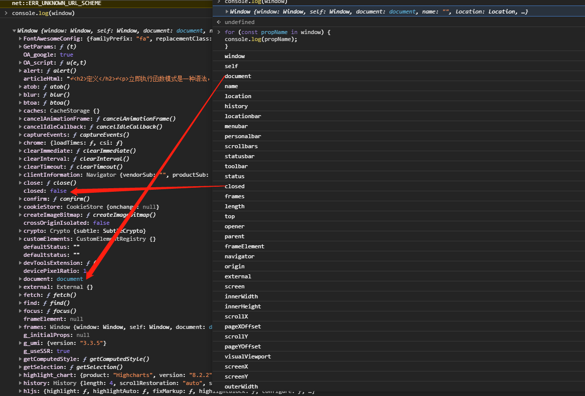

# 语言基础

## 语句

### for-in语句

for-in 语句是一种严格的迭代语句，用于枚举对象中的非符号键属性，不能保证返回对象属性的顺序。

如果 for-in 循环要迭代的变量是 null 或 undefined ，则不执行循环体。




### for-of语句

for-of 语句是一种严格的迭代语句，用于遍历可迭代对象的元素。

如果尝试迭代的变量不支持迭代，则 for-of 语句会抛出错误。

// TODO  关于可迭代对象 记得补充！！！

### 标签语句，break和continue语句

```javascript
start: for (let i = 0; i < count; i++) {
   console.log(i);
}
```

 start 是一个标签，可以在后面通过 break 或 continue 语句引用。标签语句的典型应用场景是嵌套循环。

 break 语句用于立即退出循环，强制执行循环后的下一条语句。而 continue 语句也用于立即退出循环，但会再次从循环顶部开始执行。

```
let num = 0;
outermost:
for (let i = 0; i < 10; i++) {
    for (let j = 0; j < 10; j++) {
        if (i == 5 && j == 5) {
        break outermost;
    }
   		num++;
    }
}
console.log(num); // 55
```

### with语句

```javascript
let qs = location.search.substring(1);
let hostName = location.hostname;
let url = location.href;
// 使用with语句
with(location) {
    let qs = search.substring(1);
    let hostName = hostname;
    let url = href;
}
```


### switch 语句

### 函数

返回值后面的不会被执行

## 小结

JavaScript 的核心语言特性在 ECMA-262 中以伪语言 ECMAScript 的形式来定义。ECMAScript包含所有基本语法、操作符、数据类型和对象，能完成基本的计算任务，但没有提供获得输入和产生输出的机制。理解 ECMAScript 及其复杂的细节是完全理解浏览器中 JavaScript 的关键。下面总结一下ECMAScript 中的基本元素。

1. ECMAScript 中的基本数据类型包括 Undefined 、 Null 、 Boolean 、 Number 、 String 和 Symbol 。
2. 与其他语言不同，ECMAScript 不区分整数和浮点值，只有 Number 一种数值数据类型。
3. Object 是一种复杂数据类型，它是这门语言中所有对象的基类。
4. 严格模式为这门语言中某些容易出错的部分施加了限制。
5. ECMAScript 提供了 C 语言和类 C 语言中常见的很多基本操作符，包括数学操作符、布尔操作符、关系操作符、相等操作符和赋值操作符等。
6. 这门语言中的流控制语句大多是从其他语言中借鉴而来的，比如 if 语句、 for 语句和 switch语句等。

ECMAScript 中的函数与其他语言中的函数不一样。

1. 不需要指定函数的返回值，因为任何函数可以在任何时候返回任何值。
2. 不指定返回值的函数实际上会返回特殊值 undefined 。

