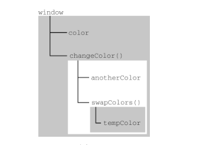
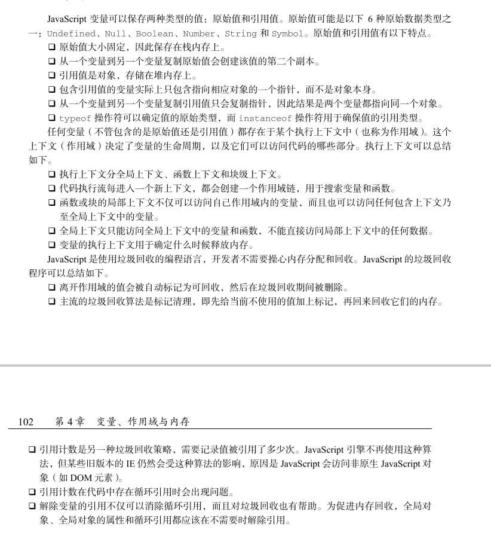

# 变量、作用域与内存

## 4.1 原始值与引用值

六种原始值： Undefined 、 Null 、 Boolean 、 Number 、 String 和 Symbol。保存原始值的变量是按值（by value）访问的，我们操作的就是存储在变量中的实际值。

在操作对象时，实际上操作的是对该对象的引用（reference）而非实际的对象本身。保存引用值的变量是按引用（by reference）访问的。

### 复制

在通过变量把一个原始值赋值到另一个变量时，原始值会被复制到新变量的位置。

在把引用值从一个变量赋给另一个变量时，存储在变量中的值也会被复制到新变量所在的位置。区别在于，这里复制的值实际上是一个指针，它指向存储在堆内存中的对象。操作完成后，两个变量实际上指向同一个对象。

### 传递参数

所有函数的参数都是按值传递的

## 4.2 执行上下文与作用域

变量或函数的上下文决定了它们可以访问哪些数据，以及它们的行为。每个上下文都有一个关联的变量对象（variable object），而这个上下文中定义的所有变量和函数都存在于这个对象上。

在浏览器中，全局上下文就是我们常说的 window 对象。

上下文中的代码在执行的时候，会创建变量对象的一个作用域链（scope chain）。作用域链决定了各级上下文中的代码在访问变量和函数时的顺序。代码正在执行的上下文的变量对象始终位于作用域链的最前端。

作用域链

```javascript
var color = "blue";
function changeColor() {
    let anotherColor = "red";
        function swapColors() {
            let tempColor = anotherColor;
            anotherColor = color;
            color = tempColor;
            // 这里可以访问 color、anotherColor 和 tempColor
        }
        // 这里可以访问 color 和 anotherColor，但访问不到 tempColor
    swapColors();
}
// 这里只能访问 color
changeColor();
```




内部上下文可以通过作用域链访问外部上下文中的一切，但外部上下文无法访问内部上下文中的任何东西。

### 作用域链增强

某些语句会导致在作用域链前端临时添加一个上下文，这个上下文在代码执行后会被删除。

- try / catch 语句的 catch 块
- with 语句 

对 with 语句来说，会向作用域链前端添加指定的对象；对 catch 语句而言，则会创建一个新的变量对象，这个变量对象会包含要抛出的错误对象的声明。

### 变量声明

let 的行为非常适合在循环中声明迭代变量。使用 var 声明的迭代变量会泄漏到循环外部。

const声明只应用到顶级原语或者对象。换句话说，赋值为对象的 const 变量不能再被重新赋值为其他引用值，但对象的键则不受限制。如果想让整个对象都不能修改，可以使用 Object.freeze()。

## 4.3 垃圾回收

自动内存管理实现内存分配和闲置资源回收。

确定哪个变量不会再使用，然后释放它占用的内存。这个过程是周期性的，即垃圾回收程序每隔一定时间（或者说在代码执行过程中某个预定的收集时间）就会自动运行。

方式：标记清理和引用计数。

解除对一个值的引用并不会自动导致相关内存被回收。解除引用的关键在于确保相关的值已经不在上下文里了，因此它在下次垃圾回收时会被回收。

1. 通过 const 和 let 声明提升性能

2. 隐藏类和删除操作

   避免 JavaScript 的“先创建再补充”（ready-fire-aim）式的动态属性赋值，并在构造函数中一次性声明所有属性

   即使两个实例使用了同一个构造函数，它们也不再共享一个隐藏类。动态删除属性与动态添加属性导致的后果一样。最佳实践是把不想要的属性设置为 null，目的是共用同一个隐藏类。

3. 内存泄漏

   a.意外声明全局变量

   b.定时器

4. 静态分配与对象池

## 4.4 小结





