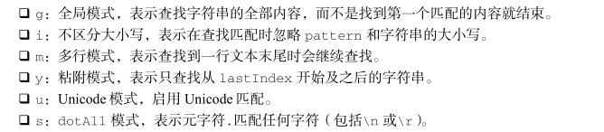

# 基本引用类型

## 1. Date

日期格式化方法

日期/时间组件方法

## 2. RegExp

标记的种类

## 3.原始值包装类型

Number：

valueOf() 方法返回 Number 对象表示的原始数值。

 toString()方法可选地接收一个表示基数的参数，并返回相应基数形式的数值字符串。

toFixed() 方法返回包含指定小数点位数的数值字符串。

String：

 concat()， slice() 、 substr()、 substring() 、 indexOf()、lastIndexOf()、startsWith、endsWith、includes、trim()、repeat