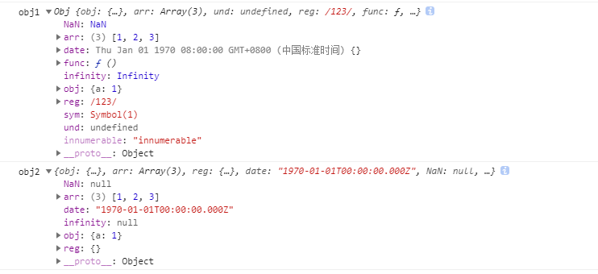

# 如何实现一个深浅拷贝？

## 浅拷贝的原理和实现

### 方法一：object.assign

该方法的第一个参数是拷贝的目标对象，后面的参数是拷贝的来源对象（也可以是多个来源）

object.assign 的语法为：Object.assign(target, ...sources)

但是使用 object.assign 方法有几点需要注意：

- 它不会拷贝对象的继承属性；
- 它不会拷贝对象的不可枚举的属性；
- 可以拷贝 Symbol 类型的属性。

可以简单理解为：Object.assign 循环遍历原对象的属性，通过复制的方式将其赋值给目标对象的相应属性，来看一下这段代码，以验证它可以拷贝 Symbol 类型的对象

### 方法二：扩展运算符方式

```javascript
/* 对象的拷贝 */
let obj = { a: 1, b: { c: 1 } };
let obj2 = { ...obj };
obj.a = 2;
console.log(obj); //{a:2,b:{c:1}} console.log(obj2); //{a:1,b:{c:1}}
obj.b.c = 2;
console.log(obj); //{a:2,b:{c:2}} console.log(obj2); //{a:1,b:{c:2}}
/* 数组的拷贝 */
let arr = [1, 2, 3];
let newArr = [...arr]; //跟arr.slice()是一样的效果
```

### 方法三：concat 拷贝数组

```javascript
let arr = [1, 2, 3];
let newArr = arr.concat();
newArr[1] = 100;
console.log(arr); // [ 1, 2, 3 ]
console.log(newArr); // [ 1, 100, 3 ]
```

### 方法四：slice 拷贝数组

slice 方法会返回一个新的数组对象，这一对象由该方法的前两个参数来决定原数组截取的开始和结束时间，是不会影响和改变原始数组的。slice 的语法为：arr.slice(begin, end);

## 手工实现一个浅拷贝

```javascript
const shallowClone = (target) => {
  if (typeof target === "object" && target !== null) {
    const cloneTarget = Array.isArray(target) ? [] : {};
    for (let prop in target) {
      if (target.hasOwnProperty(prop)) {
        cloneTarget[prop] = target[prop];
      }
    }
    return cloneTarget;
  } else {
    return target;
  }
};
```

## 深拷贝的原理和实现

将一个对象从内存中完整地拷贝出来一份给目标对象，并从堆内存中开辟一个全新的空间存放新对象，且新对象的修改并不会改变原对象，二者实现真正的分离。

### 方法一：乞丐版（JSON.stringify）

使用 JSON.stringify 实现深拷贝还是有一些地方值得注意，我总结下来主要有这几点：

1. 拷贝的对象的值中如果有函数、undefined、symbol 这几种类型，经过 JSON.stringify 序列化之后的字符串中这个键值对会消失；
2. 拷贝 Date 引用类型会变成字符串；
3. 无法拷贝不可枚举的属性；
4. 无法拷贝对象的原型链；
5. 拷贝 RegExp 引用类型会变成空对象；
6. 对象中含有 NaN、Infinity 以及 -Infinity，JSON 序列化的结果会变成 null；
7. 无法拷贝对象的循环应用，即对象成环 (obj[key] = obj)。

```javascript
function Obj() {
  this.func = function() {
    alert(1);
  };
  this.obj = { a: 1 };
  this.arr = [1, 2, 3];
  this.und = undefined;
  this.reg = /123/;
  this.date = new Date(0);
  this.NaN = NaN;
  this.infinity = Infinity;
  this.sym = Symbol(1);
}
let obj1 = new Obj();
Object.defineProperty(obj1, "innumerable", {
  enumerable: false,
  value: "innumerable",
});
console.log("obj1", obj1);
let str = JSON.stringify(obj1);
let obj2 = JSON.parse(str);
console.log("obj2", obj2);
```



### 方法二：基础版（手写递归实现）

实现 deepClone 函数封装的例子，通过 for in 遍历传入参数的属性值，如果值是引用类型则再次递归调用该函数，如果是基础数据类型就直接复制，代码如下所示。

```javascript
let obj1 = {
  a: {
    b: 1,
  },
};
function deepClone(obj) {
  let cloneObj = {};
  for (let key in obj) {
    //遍历
    if (typeof obj[key] === "object") {
      cloneObj[key] = deepClone(obj[key]); //是对象就再次调用该函数递归
    } else {
      cloneObj[key] = obj[key]; //基本类型的话直接复制值
    }
  }
  return cloneObj;
}
let obj2 = deepClone(obj1);
obj1.a.b = 2;
console.log(obj2); //  {a:{b:1}}
```

虽然利用递归能实现一个深拷贝，但是同上面的 JSON.stringify 一样，还是有一些问题没有完全解决，例如：

1. 这个深拷贝函数并不能复制不可枚举的属性以及 Symbol 类型；
2. 这种方法只是针对普通的引用类型的值做递归复制，而对于 Array、Date、RegExp、Error、Function 这样的引用类型并不能正确地拷贝；
3. 对象的属性里面成环，即循环引用没有解决。

这种基础版本的写法也比较简单，可以应对大部分的应用情况。但是你在面试的过程中，如果只能写出这样的一个有缺陷的深拷贝方法，有可能不会通过。

### 方法三：改进版（改进后递归实现）

针对上面几个待解决问题，我先通过四点相关的理论告诉你分别应该怎么做。

1. 针对能够遍历对象的不可枚举属性以及 Symbol 类型，我们可以使用 Reflect.ownKeys 方法；
2. 当参数为 Date、RegExp 类型，则直接生成一个新的实例返回；
3. 利用 Object 的 getOwnPropertyDescriptors 方法可以获得对象的所有属性，以及对应的特性，顺便结合 Object 的 create 方法创建一个新对象，并继承传入原对象的原型链；
4. 利用 WeakMap 类型作为 Hash 表，因为 WeakMap 是弱引用类型，可以有效防止内存泄漏（你可以关注一下 Map 和 weakMap 的关键区别，这里要用 weakMap），作为检测循环引用很有帮助，如果存在循环，则引用直接返回 WeakMap 存储的值。

```javascript
const isComplexDataType = (obj) =>  (typeof obj === "object" || typeof obj === "function") && obj !== null;
const deepClone = function(obj, hash = new WeakMap()) {
  if (obj.constructor === Date) return new Date(obj); // 日期对象直接返回一个新的日期对象
  if (obj.constructor === RegExp) return new RegExp(obj); //正则对象直接返回一个新的正则对象
  //如果循环引用了就用 weakMap 来解决
  if (hash.has(obj)) return hash.get(obj);
  let allDesc = Object.getOwnPropertyDescriptors(obj);
  //遍历传入参数所有键的特性
  let cloneObj = Object.create(Object.getPrototypeOf(obj), allDesc);
  //继承原型链
  hash.set(obj, cloneObj);
  for (let key of Reflect.ownKeys(obj)) {
    cloneObj[key] =
      isComplexDataType(obj[key]) && typeof obj[key] !== "function"
        ? deepClone(obj[key], hash)
        : obj[key];
  }
  return cloneObj;
};
// 下面是验证代码
let obj = {
  num: 0,
  str: "",
  boolean: true,
  unf: undefined,
  nul: null,
  obj: { name: "我是一个对象", id: 1 },
  arr: [0, 1, 2],
  func: function() {
    console.log("我是一个函数");
  },
  date: new Date(0),
  reg: new RegExp("/我是一个正则/ig"),
  [Symbol("1")]: 1,
};
Object.defineProperty(obj, "innumerable", {
  enumerable: false,
  value: "不可枚举属性",
});
obj = Object.create(obj, Object.getOwnPropertyDescriptors(obj));
obj.loop = obj; // 设置loop成循环引用的属性
let cloneObj = deepClone(obj);
cloneObj.arr.push(4);
console.log("obj", obj);
console.log("cloneObj", cloneObj);
```
