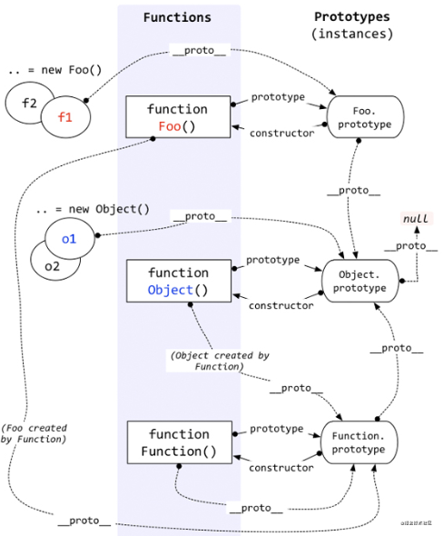
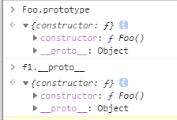

# 03 | 继承实现：探究 JS 常见的 6 种继承方式

## JS 实现继承的几种方式

### 第一种：原型链继承

<!--  -->

1. js 分为**函数对**象和**普通对象**，每个对象都有** proto **属性，但是只有函数对象才有 prototype 属性
2. 实例属性** proto**是一个对象，它有两个属性，constructor 和 \_\_ **proto**；
3. 原型对象 prototype 有一个默认的 constructor 属性，用于记录实例是由哪个构造函数创建；



```javascript
两个原则：
准则1：原型对象（即Person.prototype）的constructor指向构造函数本身
1. Person.prototype.constructor == Person
 准则2：实例（即person01）的__proto__和原型对象指向同一个地方
2. person01.__proto__ == Person.prototype
```

```javascript
原型链;
// 声明父类
function Person() {
  this.company = "凯亚";
}
function KF() {
  this.position = "开发";
}
function KF2() {
  this.position = "开发2";
}
let pyk = new KF();
console.log("pyk", pyk);
// 带
KF2.prototype = new Person();
let qq = new KF2();
console.log("qq", pyk);
```

```javascript
a = 5  a.prototype 没有 ----1      a.__proto__  ----有  Number
b = {} b.prototype 没有 ----1      a.__proto__  ----有
// 函数对象
function Foo(){
    this.name = 'Foo';
    this.play = [1, 2, 3]
}
// ex1 Foo.prototype  有 --- 1
// 两个实例
let f1 = new Foo(); ------ 2
let f2 = new Foo();

```

存在 原型属性共享问题

```javascript
function Parent1() {
  this.name = "parent1";
  this.play = [1, 2, 3];
}
function Child1() {
  this.type = "child1";
}
function Child2() {
  this.type = "child2";
}
var child1 = new Child1();
var child2 = new Child2();
Child1.prototype = new Parent1();
Child2.prototype = new Parent1();

// 定义实例
var s1 = new Child1();
var s11 = new Child1();
var s2 = new Child2();
s1.play.push(4);
console.log(s1.play, s11.play, s2.play);
```

### 第二种：构造函数继承（借助 call）

它使父类的引用属性不会被共享，优化了第一种继承方式的弊端；但是随之而来的缺点也比较明显——只能继承父类的实例属性和方法，不能继承原型属性或者方法。

### 第三种：组合继承（前两种组合）
