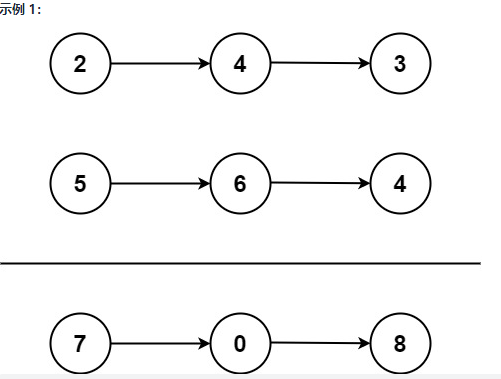
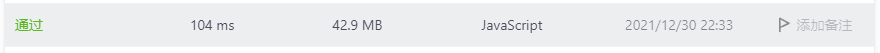

# 2.两数相加

## 题目

给你两个 非空 的链表，表示两个非负的整数。它们每位数字都是按照 逆序 的方式存储的，并且每个节点只能存储 一位 数字。

请你将两个数相加，并以相同形式返回一个表示和的链表。

你可以假设除了数字 0 之外，这两个数都不会以 0 开头。



```
输入：l1 = [2,4,3], l2 = [5,6,4]
输出：[7,0,8]
解释：342 + 465 = 807
```

```
输入：l1 = [0], l2 = [0]
输出：[0]
```

```
输入：l1 = [9,9,9,9,9,9,9], l2 = [9,9,9,9]
输出：[8,9,9,9,0,0,0,1]
```

**提示：**

- 每个链表中的节点数在范围 `[1, 100]` 内
- `0 <= Node.val <= 9`
- 题目数据保证列表表示的数字不含前导零

## 答案

::: details 点击查看我的答案————没有做出来（错误答案） 

```javascript
/**
 * Definition for singly-linked list.
 * function ListNode(val, next) {
 *     this.val = (val===undefined ? 0 : val)
 *     this.next = (next===undefined ? null : next)
 * }
 */

// 将listnode转成数组
function getArrFromListNode(value) {
    const arr = [];
    let isList = value
    while(isList.next) {
        arr.push(isList.val)
        isList = isList.next
    }
    arr.push(isList.val)
    return arr.reverse();
}

// 数组变成数字
function getNumFromArr(arr) {
    let num = 0;
    for(let i = 0; i<arr.length; i++) {
        num += +arr[i]*Math.pow(10, (arr.length - i -1));
    }
    return num;
}

// ？？？ 由数组变成链表---未完成
function getListNodeFromArr(result, onenext) {
    const p = new ListNode()
    if (result.length !== 0) {
        if(onenext !== '') {
            p.next = onenext
        }
        p.val = result[0]
        result.shift();
        if(result.length!==0) {
            getListNodeFromArr(result, p)
        }
    }
    if (result.length === 0) {
        console.log('p[pd]3333', result, p, p.next)
        return p
    }
        console.log('p[pd]1111', result, p)
    return p
}

/**
 * @param {ListNode} l1
 * @param {ListNode} l2
 * @return {ListNode}
 */
var addTwoNumbers = function(l1, l2) {
    // console.log(l1, l2)
    // l1 和 l2 换一下顺序
    const arr1 = getArrFromListNode(l1);
    const arr2 = getArrFromListNode(l2);

    // console.log(arr1,arr2)
    const num1 = getNumFromArr(arr1);
    const num2 = getNumFromArr(arr2);
    // console.log(num1,num2)

    const sum = num1 + num2;
    // console.log(sum);

    const result = sum.toString().split("").map(Number);
    console.log(result)

    const pr = getListNodeFromArr(result, '')
    console.log(pr)


};
```

:::

::: details 点击查看听了官方视频后自己还是不会写，找的网友的答案

```javascript
/**
 * Definition for singly-linked list.
 * function ListNode(val, next) {
 *     this.val = (val===undefined ? 0 : val)
 *     this.next = (next===undefined ? null : next)
 * }
 */
/**
 * @param {ListNode} l1
 * @param {ListNode} l2
 * @return {ListNode}
 */
var addTwoNumbers = function (l1,l2){
    //  定义一个新的节点
     let dummy = new ListNode();
    //  curr是用来遍历列表用的
     let curr = dummy;
      let carry = 0; //处理进位用
      while(l1 !== null || l2 !== null){
          let sum = 0;
          if(l1 !==null){
              sum += l1.val;
              l1 = l1.next;
          }
          if(l2 !== null){
              sum +=l2.val;
              l2= l2.next;
          }
        
          sum += carry; //检carry有没有进位
          curr.next = new ListNode( sum %10); 
          //把得到的sum值各位作为新的list的节点
          carry = Math.floor(sum/10);
           //如果有carry值 就暂存carry的值 carry的值是sum/10之后取整 只要整数 
           curr = curr.next  // curr往后挪一位
      }
      if(carry>0){
        curr.next = new ListNode(carry);
        // 如果最后的carry值大于0，需要单独做一个新节点（最前面的节点）
      }
      return dummy.next;//最后return出去

 }
```


:::

::: details 点击查看官方答案

```javascript
var addTwoNumbers = function(l1, l2) {
    let head = null, tail = null;
    let carry = 0; // 进位
    while (l1 || l2) {
        const n1 = l1 ? l1.val : 0;
        const n2 = l2 ? l2.val : 0;
        const sum = n1 + n2 + carry;
        if (!head) {
            head = tail = new ListNode(sum % 10);
        } else {
            tail.next = new ListNode(sum % 10);
            tail = tail.next;
        }
        carry = Math.floor(sum / 10);
        if (l1) {
            l1 = l1.next;
        }
        if (l2) {
            l2 = l2.next;
        }
    }
    if (carry > 0) {
        tail.next = new ListNode(carry);
    }
    return head;
};
```



:::


