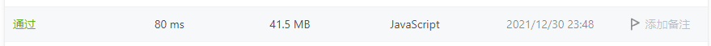

# 3.无重复字符的最长子串

## 题目

给定一个字符串 `s` ，请你找出其中不含有重复字符的 **最长子串** 的长度。

```
示例 1:

输入: s = "abcabcbb"
输出: 3 
解释: 因为无重复字符的最长子串是 "abc"，所以其长度为 3。

示例 2:

输入: s = "bbbbb"
输出: 1
解释: 因为无重复字符的最长子串是 "b"，所以其长度为 1。

示例 3:

输入: s = "pwwkew"
输出: 3
解释: 因为无重复字符的最长子串是 "wke"，所以其长度为 3。
     请注意，你的答案必须是 子串 的长度，"pwke" 是一个子序列，不是子串。
     
示例 4:

输入: s = ""
输出: 0
```

## 答案

::: details 点击查看我的答案 

```javascript
/**
 * @param {string} s
 * @return {number}
 */
// （思路总是跑偏，需要多练习啊）
var lengthOfLongestSubstring = function(s) {
    let arr = s.split('')
    const dbarr= Array.from(new Set(arr))
    console.log(dbarr)
    const obj = {}

    for(let i=0;i<dbarr.length;i++) {
        let indexarr = []
        let index = s.indexOf(dbarr[i])
        while(index !== -1) {
            indexarr.push(index)
            index = s.indexOf(dbarr[i], index + 1)
            obj[dbarr[i]] = indexarr
        }

    }
        console.log(obj)
//         let i =0;
//         let num = 0
// while(i<s.length){

// }

        return Object.keys(obj).length
};

```

:::

::: details 点击查看参考答案

```javascript
var lengthOfLongestSubstring = function(s) {
    let arr = [], max = 0
    for(let i = 0; i < s.length; i++) {
        let index = arr.indexOf(s[i])
        if(index !== -1) {
            arr.splice(0, index+1);
        }
        arr.push(s.charAt(i))
        max = Math.max(arr.length, max) 
    }
    return max
};
// 参考链接
// https://leetcode-cn.com/problems/longest-substring-without-repeating-characters/solution/zi-jie-leetcode3wu-zhong-fu-zi-fu-de-zui-chang-zi-/%EF%BC%88%E5%9B%BE%E7%94%BB%E7%9A%84%E6%98%AF%E7%9C%9F%E7%9A%84%E5%A5%BD%E7%90%86%E8%A7%A3%EF%BC%8C%E5%B9%B6%E4%B8%94%E8%BF%98%E6%9C%89%E5%A4%9A%E7%A7%8D%E6%96%B9%E6%B3%95%EF%BC%8C%E6%8E%A8%E8%8D%90%E5%93%A6~%EF%BC%89/
```



:::