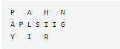
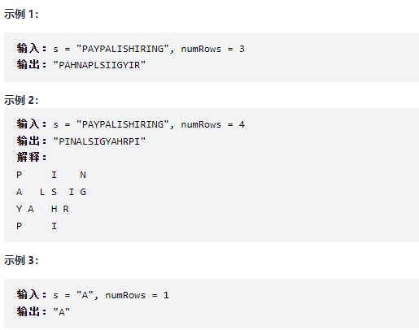
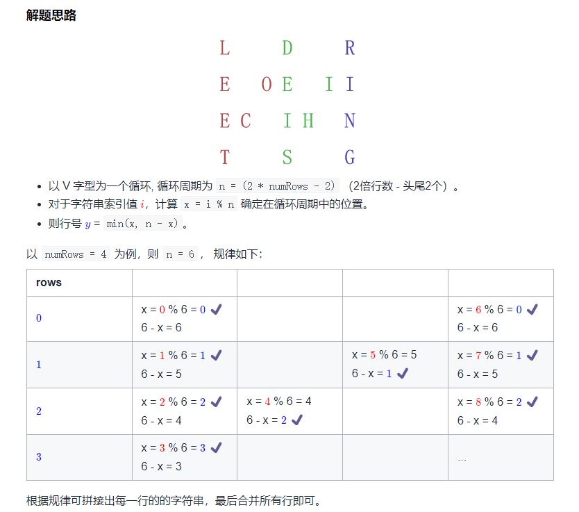

# 6.Z 字形变换

## 题目

将一个给定字符串 s 根据给定的行数 numRows ，以从上往下、从左到右进行 Z 字形排列。

比如输入字符串为 "PAYPALISHIRING" 行数为 3 时，排列如下：



之后，你的输出需要从左往右逐行读取，产生出一个新的字符串，比如："PAHNAPLSIIGYIR"。

请你实现这个将字符串进行指定行数变换的函数：

string convert(string s, int numRows);



## 答案

::: details 我的答案

```javascript
/**
 * @param {string} s
 * @param {number} numRows
 * @return {string}
 */
var convert = function(s, numRows) {
    const sarr = s.split('')
    let rr = new Array(numRows)
    const one = (numRows - 1) * 2 // 一次遍历几个
    const num = Math.ceil(sarr.length / one) // 遍历的次数
    // console.log('num', num)
    let rrin = new Array(numRows - 1)
    rrin.fill('')
    rr.fill(rrin)
    for(let i=0;i<sarr.length;i++) {
        // rr[line].push(sarr[i],)
        let index = i / numRows // 判断第几个index 偶数的话是从上向下，奇数是向上
        let iinOne = Math.floor(i / numRows)  // 判断第几个index 偶数的话是从上向下，奇数是向上
        let line = i % numRows; // 判断第几行
        let indexInOne = i % one // 一次遍历中的第几个
        let rightIndex = indexInOne >numRows -1 ? indexInOne-numRows : indexInOne
        rightIndex = iinOne*(numRows - 1) + rightIndex
        rr[line][rightIndex] = sarr[i]
        // console.log(rr[line][rightIndex])
        // let qkb = numRows - line - 1
        // let hkb = numRows - qkb
        // // console.log('p:',sarr[i],i,line)
        // rr[line].push(sarr[i])
    }
    console.log(rr)

};
```

:::

::: details 参考答案



```javascript
/**
 * @param {string} s
 * @param {number} numRows
 * @return {string}
 */
var convert = function(s, numRows) {
    if (numRows === 1) return s;
    const rows = new Array(numRows).fill("");
    const n = 2 * numRows - 2;
    for(let i = 0; i < s.length; i++) {
        const x = i % n;
        rows[Math.min(x, n - x)] += s[i];
    }
    return rows.join("");
};
```


:::