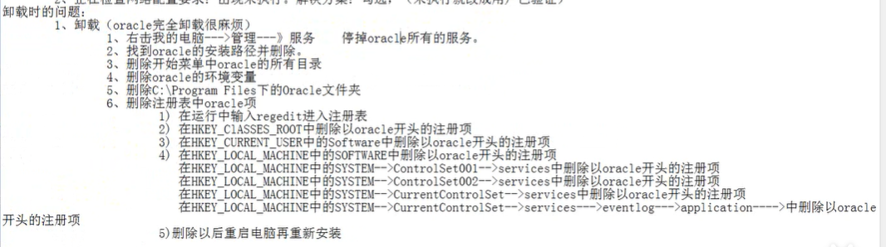

# 安装数据库

数据库安装包路径:

链接：https://pan.baidu.com/s/1WbHv79uqp_38EYIZZI3bIQ
提取码：cls1
--来自百度网盘超级会员 V4 的分享

## 一、什么是数据库 database

就是存储数据的仓库。货架(表 table)

## 二、数据库的种类

1、小型的数据库:access
2、中型的数据库:Mysql,Sqlserver
3、大型的数据库:Oracle, DB2,Sybase,达梦四、Oracle 数据库的版本
9i internet 网络
10G 11G(面试)Grid 网格 12C clound 云技术

## 五、安装数据库

安装时的问题:
1、系统版本不支持。解决方案:找到 oralcellg\database \stagelprereqldb \refhost.xml2、正在检查网络配置要求:出现未执行。解决方案:勾选，（未执行就改成用户已验证)

!!安装失败 提示："安装 oracle [INS-32025] 所选安装与指定 Oracle 主目录中已安装的软件冲突” 的问题"

当我再次重装的时候，选择之前安装的目录（已经删除干净了），就出现了 “[INS-32025] 所选安装与指定 Oracle 主目录中已安装的软件冲突” 的问题，解决办法为：删除 C:\Program Files (x86)\Oracle\Inventory\ContentsXML 目录下的 inventory.xml 文件即可。（附带改文件内容，该目录地址在这里被占用了，所以会报错）

## 5.数据库的卸载

## 六、默认的三个用户

1、用户名: sys,密码:安装时输入的密码 admin,老板:超级管理员。在登录时必须选择 sysdba

2、用户名: system，密码:安装时输入的密码 admin,经理:管理其他的普通用户。

3、用户名: scott，密码: tiger,试用员工:默认被锁定 lock,可以叠录 system 用户解锁。

## 七、如何登陆

1、开始--->所有程序--->选择 0racle--->应用程序开发--->SQLPlus--->输入用户名和密码(看不见)--->回车。

2.cmd->SQLPlus--->输入用户名和密码(看不见)--->回车

3.pl/sql developer 工具连接

修改 system 密码

输入 sqlplus /nolog ----- 实现无用户名登录

conn /as sysdba ----- 连接到数据本地数据

alter user system identified by password; ----- 修改 system 密码 为 password(你自定义的密码)
