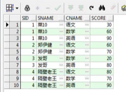

```sql
-- 一、GROUP BY 分组查询
--1、分组函数：作用于一组数据，得到一个结果
--查询 emp 表中最高工资 max 最高的值
SELECT MAX(SAL) FROM EMP e
--1.max 最大值 2.min 最小值 3.avg 平均值 4.sum 求和
--5.count() 求个数 null 不会被记录个数 一般使用 count(_)
--计算表中有多少行记录
SELECT count(_) FROM EMP e
--2.group by 手动分组。
--1.当 gruop by 单独使用时，表示去重
--查询表中有多少个岗位
SELECT _ FROM EMP
SELECT JOB FROM EMP GROUP BY JOB
SELECT DISTINCT JOB FROM EMP
--2.当 group by 和 分组函数一起使用时,分组函数会作用于分组之后每个组的数据
--查询每个部门有多少人
SELECT DEPTNO ,COUNT(DEPTNO) FROM EMP GROUP BY DEPTNO
--查询每个岗位的最高工资
SELECT JOB , MAX(SAL) maxsal FROM EMP GROUP BY JOB ORDER BY maxsal DESC
--查询每个领导下有多少个手下，以及这些手下的最高工资，平均工资
SELECT MGR, COUNT(_), max(SAL), AVG(SAL) FROM EMP WHERE MGR IS NOT NULL GROUP BY MGR
--3.根据多个字段分组（没有顺序）
--查询每个部门每个岗位上有多少人
SELECT DEPTNO,JOB,COUNT(_) FROM EMP GROUP BY DEPTNO ,JOB
--查询每个部门的每个领导下的工资和
SELECT DEPTNO ,MGR , SUM(SAL) FROM EMP WHERE MGR IS NOT NULL GROUP BY DEPTNO ,MGR ORDER BY DEPTNO
--4.分组后过滤 HAVING （select from where group by having order by ）where 分组前过滤
--查询每个部门不超过 3 个人的部门
SELECT DEPTNO ,COUNT(_) FROM EMP GROUP BY DEPTNO HAVING count(_) <= 3
--查询平均工资超过 2000 的部门编号
SELECT DEPTNO ,AVG(sal) FROM EMP GROUP BY DEPTNO HAVING AVG(sal) >= 2000
--查询每个部门有多少个员工工资不低于 1500 的员工
SELECT DEPTNO,COUNT(_) FROM EMP WHERE sal >= 1500 GROUP BY DEPTNO
--查询哪个部门有少于 2 个员工工资不低于 1500 的员工
SELECT DEPTNO ,COUNT(_) FROM EMP WHERE sal >= 1500 GROUP BY DEPTNO HAVING COUNT(_) <= 2
--课后作业：
CREATE TABLE SC(
sid NUMBER,
sname varchar2(50),
cname varchar2(50),
score number
)
SELECT _ FROM SC s  （具体数据见下图）

--查询至少选修了三门课程的学生编号和姓名
SELECT SID ,SNAME FROM SC s
SELECT SID ,SNAME , COUNT(_) FROM SC GROUP BY SNAME, SID HAVING COUNT(_) >=3
--查询至少选修了两门看起来像"语"的课程的学生编号和姓名
SELECT SID ,SNAME , COUNT(_) FROM SC WHERE CNAME LIKE '%语%' GROUP BY SID ,SNAME HAVING COUNT(_) >= 2
--查询至少选修了两门课程并且所选课程全部及格的学生编号和姓名
-- 错误写法:
SELECT SNAME ,SID FROM SC WHERE SCORE >=60 GROUP BY SNAME ,SID HAVING COUNT(_) >= 2
-- 正确写法：
SELECT SNAME ,SID, count(cname) FROM SC GROUP BY SNAME ,SID HAVING count(cname) >= 2 AND min(SCORE) >=60
-- 解题思路：
-- 1.先找 where 条件，看是否可过滤
-- 2.分组
-- 3.分组后过滤 HAVING
-- 注意：
-- 1.在 select 字句中除了分组函数外的字段，在 group by 中必须有，反之无要求
-- 2.WHERE 分组前过滤 having 是分组后过滤
-- 3.在 where 中不能使用分组函数，在 having 中可用使用分组函数
-- 练习题
-- 查询每个部门中工资不低于 1600 的员工不少于 2 个的部门编号
SELECT DEPTNO,COUNT(_) FROM EMP WHERE sal >= 1600 GROUP BY DEPTNO HAVING COUNT(_) >=2
--二、子查询
-- 查询最高工资
SELECT _ FROM emp WHERE sal = (SELECT MAX(sal) FROM emp)
-- 查询工资比 BLAKE 高的员工信息
SELECT _ FROM EMP WHERE sal > (SELECT SAL FROM EMP WHERE ENAME = 'BLAKE')
查询和 SMITH 在同一个部门同一个岗位的员工信息
SELECT _ FROM EMP WHERE JOB = (SELECT JOB FROM EMP WHERE ENAME = 'SMITH') AND DEPTNO = (SELECT DEPTNO FROM EMP WHERE ENAME = 'SMITH')
SELECT _ FROM EMP WHERE (JOB,DEPTNO) = (SELECT JOB,DEPTNO FROM EMP WHERE ENAME = 'SMITH')

-- 特点：1.使用小扩号 2.一般放在关系运算符的右边 3.一般情况下，子查询出现在 where 字句和 from 字句中 4.子查询又分为单行子查询和多行子查询
-- 单行子查询：子查询结果只有一行 一般使用关系运算符运算 >,<,=之类的
-- 多行子查询：子查询结果有多行 使用 IN 或者 NOT IN 计算
--先查询岗位中包含 S 的岗位，然后在查询在这些岗位上的员工信息
SELECT _ FROM EMP WHERE JOB IN (SELECT DISTINCT JOB FROM EMP e WHERE e.JOB LIKE '%S%')
--查询没有员工的部门的部门名称
SELECT _ FROM DEPT WHERE DEPTNO NOT IN (SELECT DISTINCT DEPTNO FROM EMP e )
当子查询在 from 字句中，可以把这个子查询当成一个表
查询第 6~10 条的记录 rownum 伪列(可以使用<和<=，不能使用>和>=10)
SELECT e.*, rownum rm FROM EMP e WHERE rownum <=10

select * from (select e.*, rownum rm from emp e ) t where t.rm >= 6 and t.rm <=10
```

